---
tags:
  - scrolllab
  - reference-analysis
  - atrium
aliases:
  - Atrium analysis
  - analyze atrium
analyzed: 2026-08-24
source: https://kononenkogroup.com/
beats: 33
---

# Atrium — análisis de referencia

Generado por `scripts/analyze-reference.mjs` el 2026-08-24.

**URL:** https://kononenkogroup.com/  
**SKU sugerido:** `atrium`  
**Title:** Kononenko Architectural Bureau  
**Beats:** 33 (muestreo adaptativo; solo cambios) · maxScroll=19034px

## Librerías detectadas

- `lenis`
- `three`
- `react`

### Scripts (muestra)

- `https://kononenkogroup.com/_nuxt/BJv2xQ-z.js`
- `https://www.googletagmanager.com/gtag/js?id=G-VT0FEXWY3P`
- `https://static.cloudflareinsights.com/beacon.min.js/v4513226cdae34746b4dedf0b4dfa099e1781791509496`

### Fonts cargadas

- n
- h

`html.class`: `lenis lenis-stopped`

## Técnicas inferidas

- Smooth scroll: Lenis
- 3D: three.js
- Sticky/fixed nodes: header, div
- Beats significativos: 33 (solo cambios de firma)

## Capas Framer (`data-framer-name`)

- (no Framer names)

## Headings

| Tag | Texto | Font | Size |
|---|---|---|---|
| H1 | KononenkoArchitecturalBureau | n | 14.25px |
| H1 | Kononenko Architectural Bureau | n | 60px |
| H2 | SystematicClarity & Creativity | n | 131.25px |
| H2 | Architectural concept, facade and planning solutions, sketch | h | 88.5px |
| H2 | From Sketch to Strategy | n | 60px |
| H2 | Precision in Development | n | 60px |
| H2 | Pokrovskoe Private House | n | 12px |
| H2 | Millenium Private Park | n | 12px |
| H2 | Bolshevik Residential | n | 12px |
| H2 | KNS Stolbovo | n | 12px |
| H2 | Kotelnaya Kinetics | n | 12px |
| H2 | Vision Mansion | n | 12px |
| H2 | Almaty Hotel Ornament Stone | n | 12px |
| H2 | Eli House Corner Plot | n | 12px |
| H2 | Refined & Bold Essential | n | 60px |
| H2 | Simplicity & Clarity of Approach | n | 60px |
| H2 | People & Process | h | 12px |
| H2 | 2011 Year of Foundation | n | 131.25px |
| H2 | The World’s Most Ambitious Brands Choose to Work With Us | h | 131.25px |
| H1 | KononenkoArchitecturalBureau | n | 14.25px |

## Beats (fondo / figura / texto)

### Beat 0 — 0% (y=0)

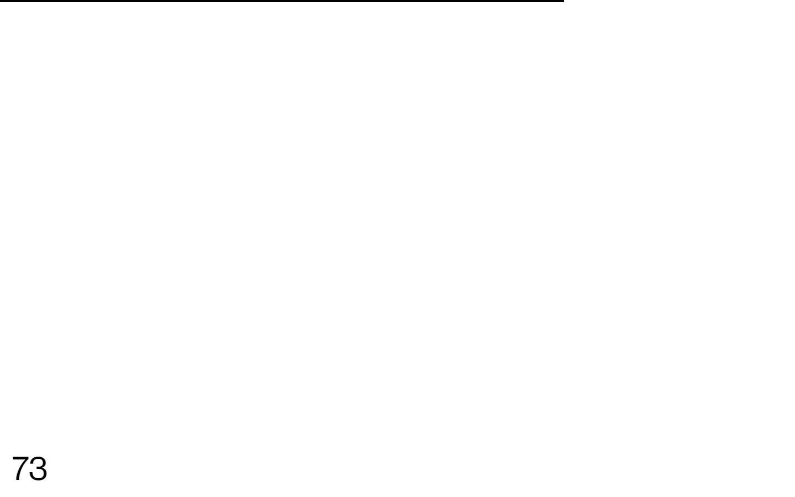

**Cambios vs anterior**
- beat inicial

**Fondo:** `rgb(255, 255, 255)`

**Figuras / media**
- **div** (div) opacity=1 · `matrix(1.1, 0, 0, 1.1, 0, 0)`
- **div** (div) opacity=1 · `matrix(1, 0, 0, 1, 0, 0)`
- **img** (img) opacity=1
- **canvas** (canvas) opacity=1
- **span** (span) opacity=1 · `matrix(1, 0, 0, 1, 0, 78.78)`

**Texto visible**
- “KononenkoArchitecturalBureau” · 14.25px n
- “72” · 60px n
- “Kononenko Architectural Bureau” · 60px n

**Sticky:** header, div, div, div

### Beat 1 — 3% (y=595)

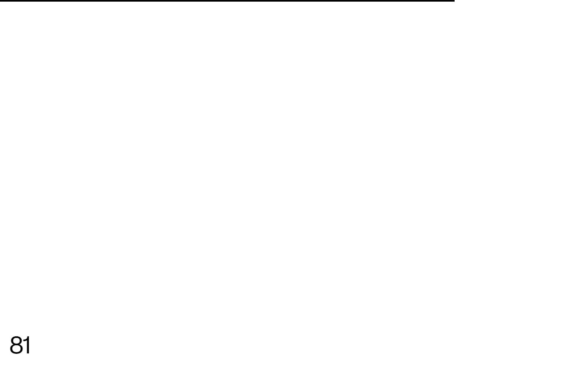

**Cambios vs anterior**
- figura mueve: div opacity 1→1 t=matrix(1.1, 0, 0, 1.1, 0, 0)
- figura mueve: div opacity 1→1 t=matrix(1, 0, 0, 1, 0, 119)
- figura mueve: img opacity 1→1 t=matrix(1.0444, 0, 0, 1.0444, 0, -135.467
- figura mueve: span opacity 1→1 t=matrix(1, 0, 0, 1, 0, 77.3607)
- figura mueve: span opacity 1→1 t=matrix(1, 0, 0, 1, 0, 159.075)
- figura mueve: span opacity 1→1 t=matrix(1, 0, 0, 1, 0, 118.672)
- figura mueve: span opacity 1→1 t=matrix(1, 0, 0, 1, 0, 159.075)
- texto aparece: “79”
- texto aparece: “SystematicClarity & Creativity”
- texto sale: “72”

**Fondo:** `rgb(255, 255, 255)`

**Figuras / media**
- **div** (div) opacity=1 · `matrix(1.1, 0, 0, 1.1, 0, 0)`
- **div** (div) opacity=1 · `matrix(1, 0, 0, 1, 0, 119)`
- **img** (img) opacity=1
- **canvas** (canvas) opacity=1
- **img** (img) opacity=1 · `matrix(1.0444, 0, 0, 1.0444, 0, -135.467)`
- **span** (span) opacity=1 · `matrix(1, 0, 0, 1, 0, 77.3607)`

**Texto visible**
- “KononenkoArchitecturalBureau” · 14.25px n
- “79” · 60px n
- “Kononenko Architectural Bureau” · 60px n
- “SystematicClarity & Creativity” · 131.25px n

**Sticky:** header, div, div, div

### Beat 2 — 6% (y=1190)

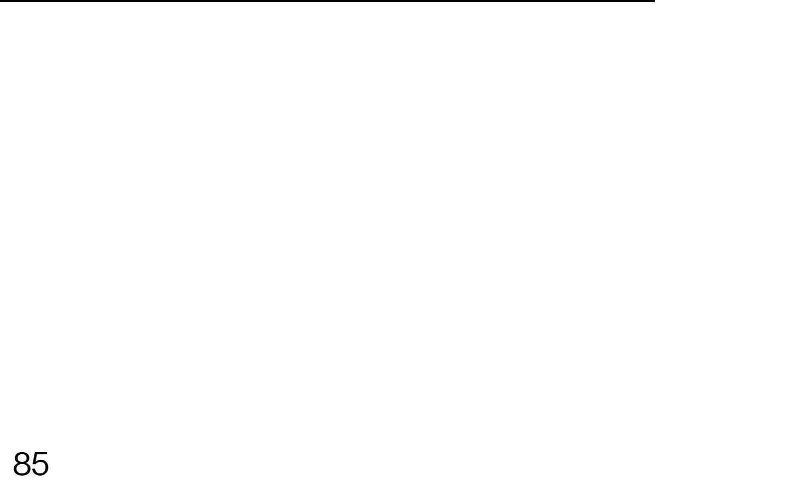

**Cambios vs anterior**
- figura mueve: img opacity 1→1 t=matrix(1.0444, 0, 0, 1.0444, 0, -29.6892
- figura mueve: span opacity 1→1 t=matrix(1, 0, 0, 1, 0, 77.3607)
- figura mueve: span opacity 1→1 t=matrix(1, 0, 0, 1, 0, 32.9323)
- figura mueve: span opacity 1→1 t=matrix(1, 0, 0, 1, 0, 50.6772)
- texto aparece: “84”
- texto sale: “79”
- texto sale: “Kononenko Architectural Bureau”

**Fondo:** `rgb(255, 255, 255)`

**Figuras / media**
- **canvas** (canvas) opacity=1
- **img** (img) opacity=1 · `matrix(1.0444, 0, 0, 1.0444, 0, -29.6892)`
- **span** (span) opacity=1 · `matrix(1, 0, 0, 1, 0, 77.3607)`
- **span** (span) opacity=1 · `matrix(1, 0, 0, 1, 0, 32.9323)`
- **span** (span) opacity=1 · `matrix(1, 0, 0, 1, 0, 50.6772)`

**Texto visible**
- “KononenkoArchitecturalBureau” · 14.25px n
- “84” · 60px n
- “SystematicClarity & Creativity” · 131.25px n

**Sticky:** header, div, div, div

### Beat 3 — 9% (y=1784)

**Cambios vs anterior**
- figura mueve: img opacity 1→1 t=matrix(1.0444, 0, 0, 1.0444, 0, 75.911)
- figura mueve: span opacity 1→1 t=matrix(1, 0, 0, 1, 0, 23.6744)
- figura mueve: span opacity 1→1 t=matrix(1, 0, 0, 1, 0, 30.822)
- figura mueve: span opacity 1→1 t=matrix(1, 0, 0, 1, 0, 40.3106)
- figura mueve: span opacity 1→1 t=matrix(1, 0, 0, 1, 0, 48.48)
- figura mueve: span opacity 1→1 t=matrix(1, 0, 0, 1, 0, 48.48)
- texto aparece: “88”
- texto sale: “84”
- texto sale: “SystematicClarity & Creativity”

**Fondo:** `rgb(255, 255, 255)`

**Figuras / media**
- **canvas** (canvas) opacity=1
- **img** (img) opacity=1 · `matrix(1.0444, 0, 0, 1.0444, 0, 75.911)`
- **span** (span) opacity=1 · `matrix(1, 0, 0, 1, 0, 23.6744)`
- **span** (span) opacity=1 · `matrix(1, 0, 0, 1, 0, 30.822)`
- **span** (span) opacity=1 · `matrix(1, 0, 0, 1, 0, 40.3106)`
- **span** (span) opacity=1 · `matrix(1, 0, 0, 1, 0, 48.48)`

**Texto visible**
- “KononenkoArchitecturalBureau” · 14.25px n
- “88” · 60px n

**Sticky:** header, div, div, div

### Beat 4 — 13% (y=2379)

**Cambios vs anterior**
- figura mueve: span opacity 1→1 t=matrix(1, 0, 0, 1, 0, 87.8245)
- figura mueve: span opacity 1→1 t=matrix(1, 0, 0, 1, 0, 57.372)
- figura mueve: span opacity 1→1 t=matrix(1, 0, 0, 1, 0, 18.9278)
- figura mueve: span opacity 1→1 t=matrix(1, 0, 0, 1, 0, 14.5535)
- texto aparece: “92”
- texto aparece: “Architectural concept, facade and planning solutio”
- texto sale: “88”

**Fondo:** `rgb(255, 255, 255)`

**Figuras / media**
- **canvas** (canvas) opacity=1
- **span** (span) opacity=1 · `matrix(1, 0, 0, 1, 0, 87.8245)`
- **span** (span) opacity=1 · `matrix(1, 0, 0, 1, 0, 57.372)`
- **span** (span) opacity=1 · `matrix(1, 0, 0, 1, 0, 18.9278)`
- **span** (span) opacity=1 · `matrix(1, 0, 0, 1, 0, 14.5535)`

**Texto visible**
- “KononenkoArchitecturalBureau” · 14.25px n
- “92” · 60px n
- “Architectural concept, facade and planning solutions, sketch project, working do” · 88.5px h

**Sticky:** header, div, div, div

### Beat 5 — 16% (y=2974)

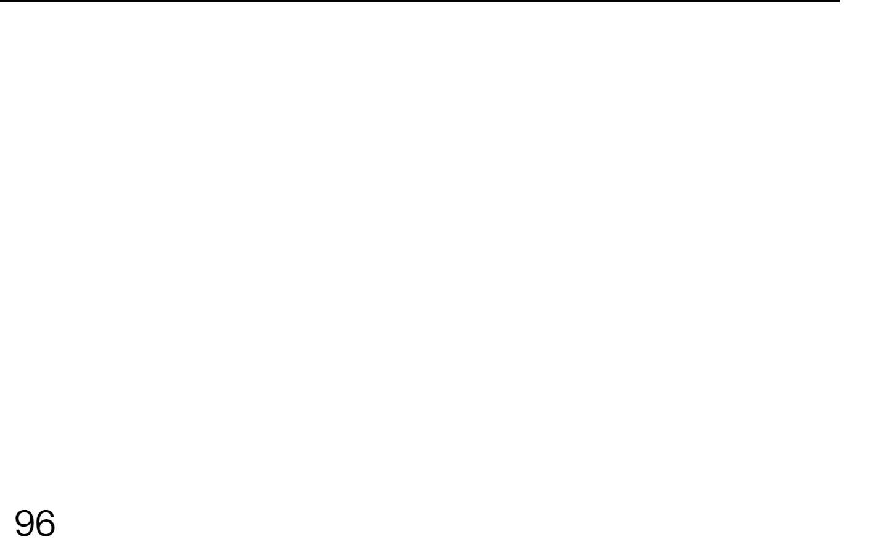

**Cambios vs anterior**
- figura mueve: span opacity 1→1 t=matrix(1, 0, 0, 1, 0, 30.4366)
- figura mueve: span opacity 1→1 t=matrix(1, 0, 0, 1, 0, 46.6331)
- figura mueve: span opacity 1→1 t=matrix(1, 0, 0, 1, 0, 71.2191)
- figura mueve: span opacity 1→1 t=matrix(1, 0, 0, 1, 0, 19.5489)
- figura entra: div (div)
- figura entra: div (div)
- figura entra: div (div)
- figura entra: div (div)
- figura entra: div (div)
- figura entra: div (div)
- figura entra: div (div)
- figura entra: div (div)
- figura entra: div (div)
- texto aparece: “95”
- texto sale: “92”

**Fondo:** `rgb(255, 255, 255)`

**Figuras / media**
- **canvas** (canvas) opacity=1
- **span** (span) opacity=1 · `matrix(1, 0, 0, 1, 0, 30.4366)`
- **span** (span) opacity=1 · `matrix(1, 0, 0, 1, 0, 46.6331)`
- **span** (span) opacity=1 · `matrix(1, 0, 0, 1, 0, 71.2191)`
- **span** (span) opacity=1 · `matrix(1, 0, 0, 1, 0, 19.5489)`
- **div** (div) opacity=1 · `matrix(1, 0, 0, 1, 0, 16.251)`

**Texto visible**
- “KononenkoArchitecturalBureau” · 14.25px n
- “95” · 60px n
- “Architectural concept, facade and planning solutions, sketch project, working do” · 88.5px h

**Sticky:** header, div, div, div

### Beat 6 — 19% (y=3569)

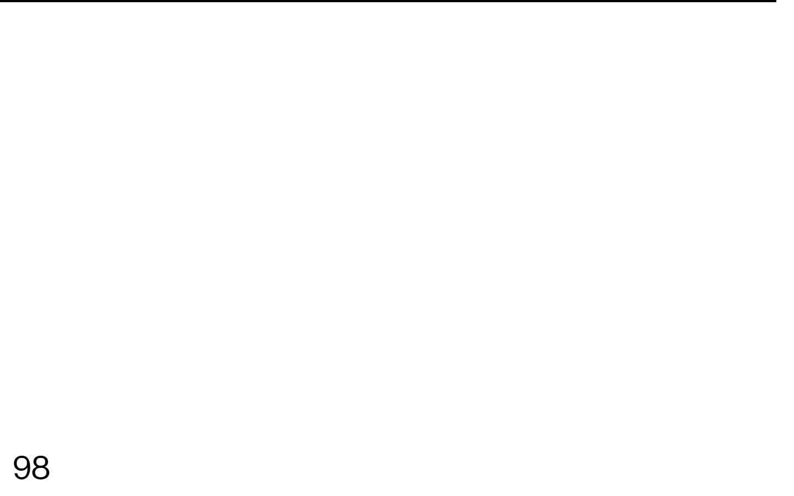

**Cambios vs anterior**
- figura mueve: span opacity 1→1 t=matrix(1, 0, 0, 1, 0, 55.0493)
- figura mueve: span opacity 1→1 t=matrix(1, 0, 0, 1, 0, 35.9688)
- figura mueve: div opacity 1→1 t=matrix(1, 0, 0, 1, 0, 10.5955)
- figura mueve: div opacity 1→1 t=matrix(1, 0, 0, 1, 0, 12.5588)
- figura mueve: div opacity 1→1 t=matrix(1, 0, 0, 1, 0, 14.8727)
- figura mueve: div opacity 1→1 t=matrix(1, 0, 0, 1, 0, 17.6063)
- figura mueve: div opacity 1→1 t=matrix(1, 0, 0, 1, 0, 20.8662)
- figura mueve: div opacity 1→1 t=matrix(1, 0, 0, 1, 0, 24.7625)
- figura mueve: div opacity 1→1 t=matrix(1, 0, 0, 1, 0, 35.1349)
- figura mueve: div opacity 1→1 t=matrix(1, 0, 0, 1, 0, 29.4669)
- texto aparece: “98”
- texto aparece: “From Sketch to Strategy”
- texto sale: “95”
- texto sale: “Architectural concept, facade and planning solutio”

**Fondo:** `rgb(255, 255, 255)`

**Figuras / media**
- **canvas** (canvas) opacity=1
- **span** (span) opacity=1 · `matrix(1, 0, 0, 1, 0, 55.0493)`
- **span** (span) opacity=1 · `matrix(1, 0, 0, 1, 0, 35.9688)`
- **div** (div) opacity=1 · `matrix(1, 0, 0, 1, 0, 10.5955)`
- **div** (div) opacity=1 · `matrix(1, 0, 0, 1, 0, 12.5588)`
- **div** (div) opacity=1 · `matrix(1, 0, 0, 1, 0, 14.8727)`

**Texto visible**
- “KononenkoArchitecturalBureau” · 14.25px n
- “98” · 60px n
- “From Sketch to Strategy” · 60px n

**Sticky:** header, div, div, div

### Beat 7 — 22% (y=4164)

**Cambios vs anterior**
- texto aparece: “100”
- texto sale: “98”
- texto sale: “From Sketch to Strategy”

**Fondo:** `rgb(255, 255, 255)`

**Figuras / media**
- **canvas** (canvas) opacity=1

**Texto visible**
- “KononenkoArchitecturalBureau” · 14.25px n
- “100” · 60px n

**Sticky:** header, div, div, div

### Beat 8 — 25% (y=4759)

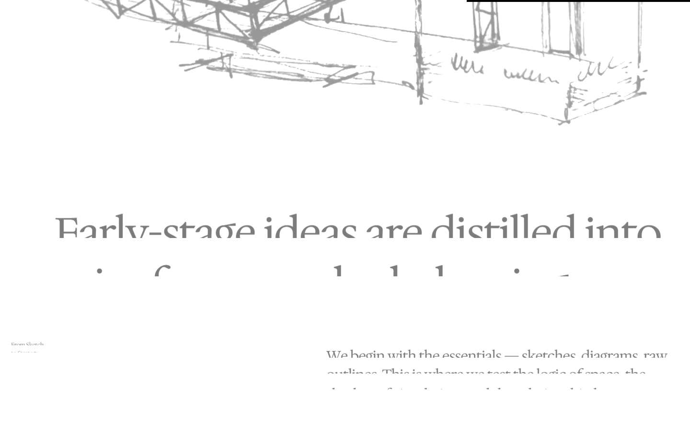

**Cambios vs anterior**
- figura entra: span (span)
- figura entra: span (span)
- figura entra: span (span)
- figura entra: span (span)
- figura entra: span (span)
- figura entra: span (span)
- figura entra: span (span)
- texto aparece: “Early-stage ideas are distilled into precise frame”

**Fondo:** `rgb(255, 255, 255)`

**Figuras / media**
- **canvas** (canvas) opacity=1
- **span** (span) opacity=1 · `matrix(1, 0, 0, 1, 0, 94.9696)`
- **span** (span) opacity=1 · `matrix(1, 0, 0, 1, 0, 125.13)`
- **span** (span) opacity=1 · `matrix(1, 0, 0, 1, 0, 61.8992)`
- **span** (span) opacity=1 · `matrix(1, 0, 0, 1, 0, 23.9821)`
- **span** (span) opacity=1 · `matrix(1, 0, 0, 1, 0, 31.2254)`

**Texto visible**
- “KononenkoArchitecturalBureau” · 14.25px n
- “100” · 60px n
- “Early-stage ideas are distilled into precise frameworks, balancing intuition, an” · 88.5px h

**Sticky:** header, div, div, div

### Beat 9 — 28% (y=5353)

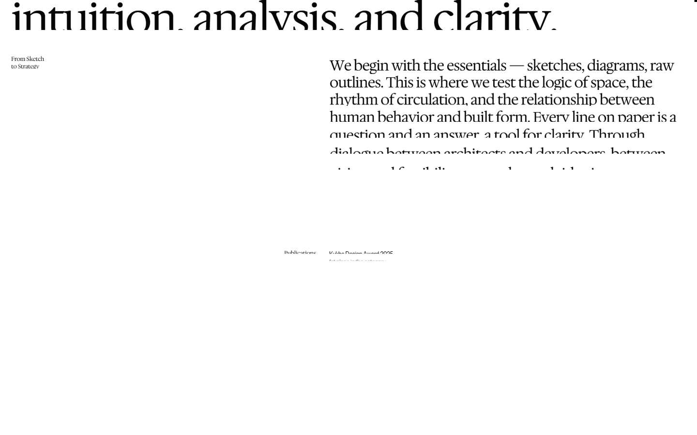

**Cambios vs anterior**
- figura mueve: span opacity 1→1 t=matrix(1, 0, 0, 1, 0, 42.676)
- figura mueve: span opacity 1→1 t=matrix(1, 0, 0, 1, 0, 6.87883)
- figura mueve: span opacity 1→1 t=matrix(1, 0, 0, 1, 0, 9.10733)
- figura mueve: span opacity 1→1 t=matrix(1, 0, 0, 1, 0, 15.578)
- figura mueve: span opacity 1→1 t=matrix(1, 0, 0, 1, 0, 20.2576)
- figura mueve: span opacity 1→1 t=matrix(1, 0, 0, 1, 0, 26.3321)
- figura mueve: span opacity 1→1 t=matrix(1, 0, 0, 1, 0, 34.3268)
- figura mueve: span opacity 1→1 t=matrix(1, 0, 0, 1, 0, 44.9968)
- figura mueve: span opacity 1→1 t=matrix(1, 0, 0, 1, 0, 11.9482)
- texto aparece: “Precision in Development”

**Fondo:** `rgb(255, 255, 255)`

**Figuras / media**
- **canvas** (canvas) opacity=1
- **span** (span) opacity=1 · `matrix(1, 0, 0, 1, 0, 42.676)`
- **span** (span) opacity=1 · `matrix(1, 0, 0, 1, 0, 6.87883)`
- **span** (span) opacity=1 · `matrix(1, 0, 0, 1, 0, 9.10733)`
- **span** (span) opacity=1 · `matrix(1, 0, 0, 1, 0, 15.578)`
- **span** (span) opacity=1 · `matrix(1, 0, 0, 1, 0, 20.2576)`

**Texto visible**
- “KononenkoArchitecturalBureau” · 14.25px n
- “100” · 60px n
- “Early-stage ideas are distilled into precise frameworks, balancing intuition, an” · 88.5px h
- “Precision in Development” · 60px n

**Sticky:** header, div, div, div

### Beat 10 — 31% (y=5948)

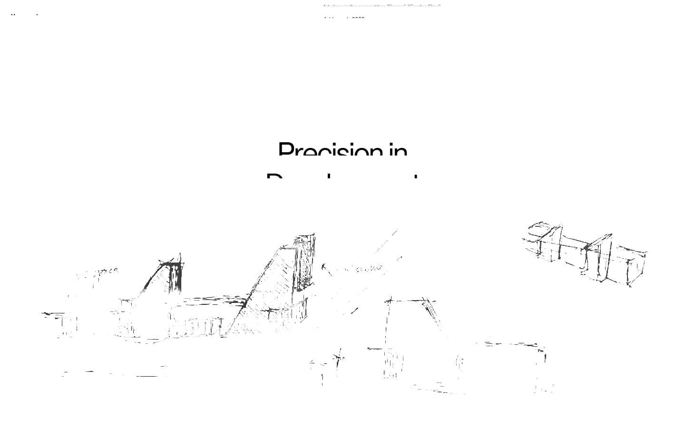

**Cambios vs anterior**
- figura mueve: span opacity 1→1 t=matrix(1, 0, 0, 1, 0, 38.8038)
- figura mueve: span opacity 1→1 t=matrix(1, 0, 0, 1, 0, 59.5365)
- texto sale: “100”
- texto sale: “Early-stage ideas are distilled into precise frame”

**Fondo:** `rgb(255, 255, 255)`

**Figuras / media**
- **canvas** (canvas) opacity=1
- **span** (span) opacity=1 · `matrix(1, 0, 0, 1, 0, 38.8038)`
- **span** (span) opacity=1 · `matrix(1, 0, 0, 1, 0, 59.5365)`

**Texto visible**
- “KononenkoArchitecturalBureau” · 14.25px n
- “Precision in Development” · 60px n

**Sticky:** header, div, div

### Beat 11 — 34% (y=6543)

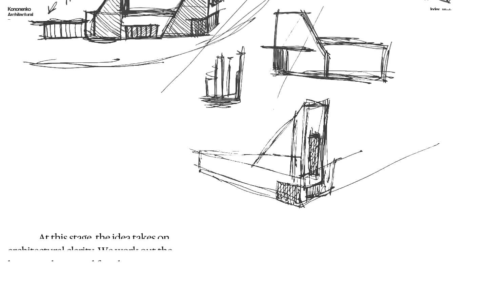

**Cambios vs anterior**
- figura mueve: span opacity 1→1 t=matrix(1, 0, 0, 1, 0, 30.693)
- figura mueve: span opacity 1→1 t=matrix(1, 0, 0, 1, 0, 40.1381)
- figura mueve: span opacity 1→1 t=matrix(1, 0, 0, 1, 0, 48.48)
- figura mueve: span opacity 1→1 t=matrix(1, 0, 0, 1, 0, 48.48)
- figura mueve: span opacity 1→1 t=matrix(1, 0, 0, 1, 0, 23.5766)
- texto sale: “Precision in Development”

**Fondo:** `rgb(255, 255, 255)`

**Figuras / media**
- **canvas** (canvas) opacity=1
- **span** (span) opacity=1 · `matrix(1, 0, 0, 1, 0, 30.693)`
- **span** (span) opacity=1 · `matrix(1, 0, 0, 1, 0, 40.1381)`
- **span** (span) opacity=1 · `matrix(1, 0, 0, 1, 0, 48.48)`
- **span** (span) opacity=1 · `matrix(1, 0, 0, 1, 0, 48.48)`
- **span** (span) opacity=1 · `matrix(1, 0, 0, 1, 0, 23.5766)`

**Texto visible**
- “KononenkoArchitecturalBureau” · 14.25px n

**Sticky:** header, div, div

### Beat 12 — 38% (y=7138)

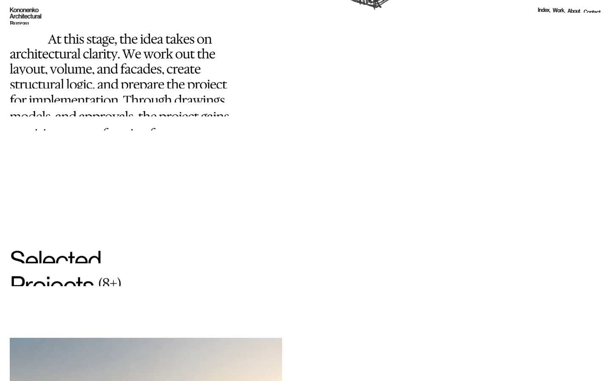

**Cambios vs anterior**
- figura entra: a (a)
- figura entra: img (img)
- figura mueve: span opacity 1→1 t=matrix(1, 0, 0, 1, 0, 51.6558)
- figura mueve: span opacity 1→1 t=matrix(1, 0, 0, 1, 0, 37.0406)
- figura mueve: span opacity 1→1 t=matrix(1, 0, 0, 1, 0, 28.3007)
- figura mueve: span opacity 1→1 t=matrix(1, 0, 0, 1, 0, 9.81686)
- figura mueve: span opacity 1→1 t=matrix(1, 0, 0, 1, 0, 12.853)
- figura mueve: span opacity 1→1 t=matrix(1, 0, 0, 1, 0, 16.7447)
- figura mueve: span opacity 1→1 t=matrix(1, 0, 0, 1, 0, 21.7607)
- figura mueve: span opacity 1→1 t=matrix(1, 0, 0, 1, 0, 36.9531)
- figura mueve: span opacity 1→1 t=matrix(1, 0, 0, 1, 0, 48.48)
- figura mueve: span opacity 1→1 t=matrix(1, 0, 0, 1, 0, 7.4376)
- texto aparece: “Selected Projects (8+)”

**Fondo:** `rgb(255, 255, 255)`

**Figuras / media**
- **canvas** (canvas) opacity=1
- **a** (a) opacity=1 · `matrix(1, 0, 0, 1, 0, 101.768)`
- **img** (img) opacity=1
- **span** (span) opacity=1 · `matrix(1, 0, 0, 1, 0, 51.6558)`
- **span** (span) opacity=1 · `matrix(1, 0, 0, 1, 0, 37.0406)`
- **span** (span) opacity=1 · `matrix(1, 0, 0, 1, 0, 28.3007)`

**Texto visible**
- “KononenkoArchitecturalBureau” · 14.25px n
- “Selected Projects (8+)” · 60px n

**Sticky:** header, div, div

### Beat 13 — 41% (y=7733)

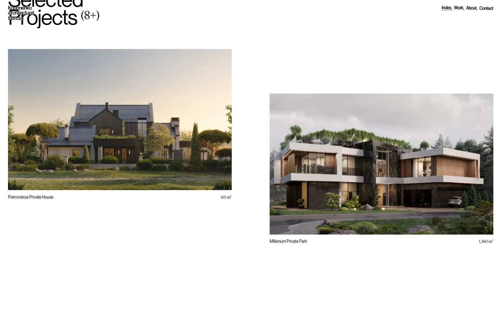

**Cambios vs anterior**
- figura mueve: a opacity 1→1 t=matrix(1, 0, 0, 1, 0, 32.0105)
- figura mueve: a opacity 1→1 t=matrix(1, 0, 0, 1, 0, 32.0105)
- figura mueve: span opacity 1→1 t=matrix(1, 0, 0, 1, 0, 16.5078)

**Fondo:** `rgb(255, 255, 255)`

**Figuras / media**
- **canvas** (canvas) opacity=1
- **a** (a) opacity=1 · `matrix(1, 0, 0, 1, 0, 32.0105)`
- **a** (a) opacity=1 · `matrix(1, 0, 0, 1, 0, 32.0105)`
- **img** (img) opacity=1
- **img** (img) opacity=1
- **span** (span) opacity=1 · `matrix(1, 0, 0, 1, 0, 16.5078)`

**Texto visible**
- “KononenkoArchitecturalBureau” · 14.25px n
- “Selected Projects (8+)” · 60px n

**Sticky:** header, div, div

### Beat 14 — 44% (y=8327)

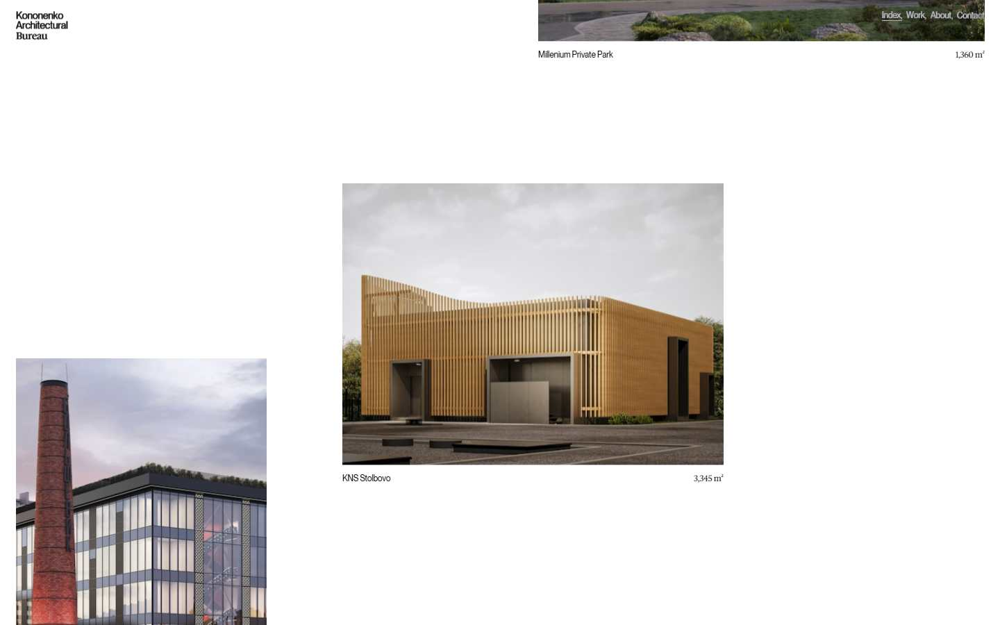

**Cambios vs anterior**
- figura mueve: a opacity 1→1 t=matrix(1, 0, 0, 1, 0, 7.87168)
- figura mueve: a opacity 1→1 t=matrix(1, 0, 0, 1, 0, 124.618)
- texto sale: “Selected Projects (8+)”

**Fondo:** `rgb(255, 255, 255)`

**Figuras / media**
- **canvas** (canvas) opacity=1
- **a** (a) opacity=1 · `matrix(1, 0, 0, 1, 0, 7.87168)`
- **img** (img) opacity=1
- **a** (a) opacity=1 · `matrix(1, 0, 0, 1, 0, 32.0105)`
- **img** (img) opacity=1
- **a** (a) opacity=1 · `matrix(1, 0, 0, 1, 0, 124.618)`

**Texto visible**
- “KononenkoArchitecturalBureau” · 14.25px n

**Sticky:** header, div, div

### Beat 15 — 47% (y=8922)

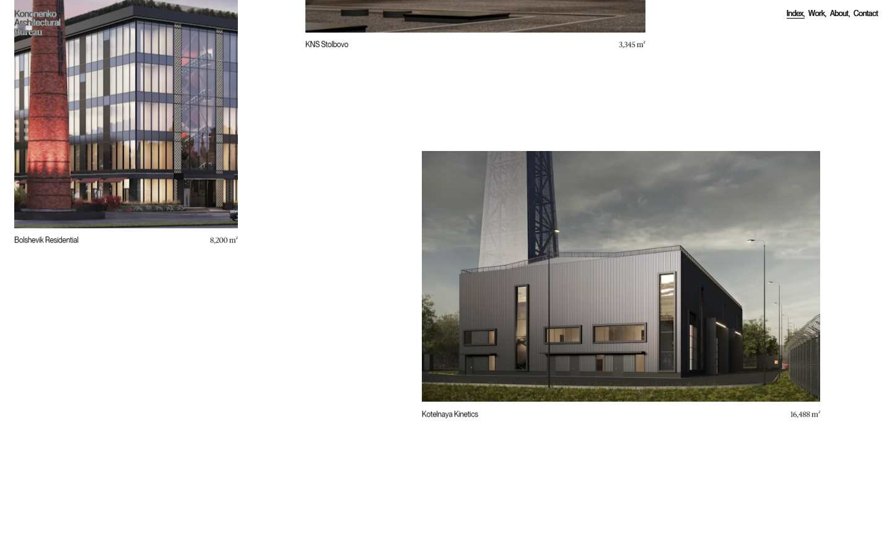

**Cambios vs anterior**
- figura mueve: a opacity 1→1 t=matrix(1, 0, 0, 1, 0, 26.1964)
- figura mueve: a opacity 1→1 t=matrix(1, 0, 0, 1, 0, 6.30245)
- figura mueve: a opacity 1→1 t=matrix(1, 0, 0, 1, 0, 33.4582)

**Fondo:** `rgb(255, 255, 255)`

**Figuras / media**
- **canvas** (canvas) opacity=1
- **a** (a) opacity=1 · `matrix(1, 0, 0, 1, 0, 26.1964)`
- **img** (img) opacity=1
- **a** (a) opacity=1 · `matrix(1, 0, 0, 1, 0, 6.30245)`
- **img** (img) opacity=1
- **a** (a) opacity=1 · `matrix(1, 0, 0, 1, 0, 33.4582)`

**Texto visible**
- “KononenkoArchitecturalBureau” · 14.25px n

**Sticky:** header, div, div

### Beat 16 — 50% (y=9517)

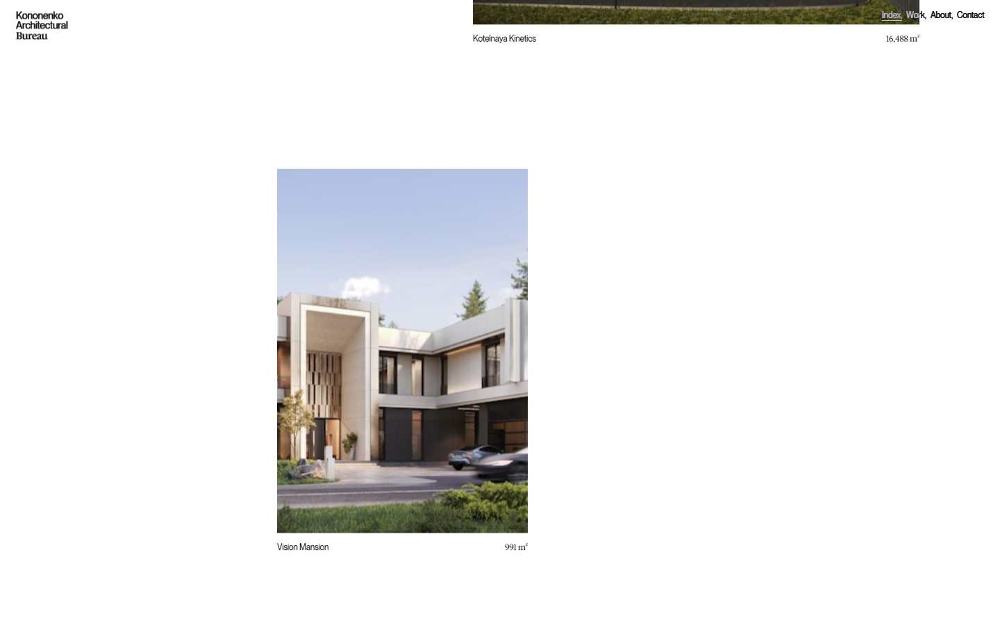

**Cambios vs anterior**
- figura mueve: a opacity 1→1 t=matrix(1, 0, 0, 1, 0, 6.60937)
- figura mueve: a opacity 1→1 t=matrix(1, 0, 0, 1, 0, 42.6058)

**Fondo:** `rgb(255, 255, 255)`

**Figuras / media**
- **canvas** (canvas) opacity=1
- **a** (a) opacity=1 · `matrix(1, 0, 0, 1, 0, 6.60937)`
- **a** (a) opacity=1 · `matrix(1, 0, 0, 1, 0, 42.6058)`
- **img** (img) opacity=1

**Texto visible**
- “KononenkoArchitecturalBureau” · 14.25px n

**Sticky:** header, div, div

### Beat 17 — 53% (y=10112)

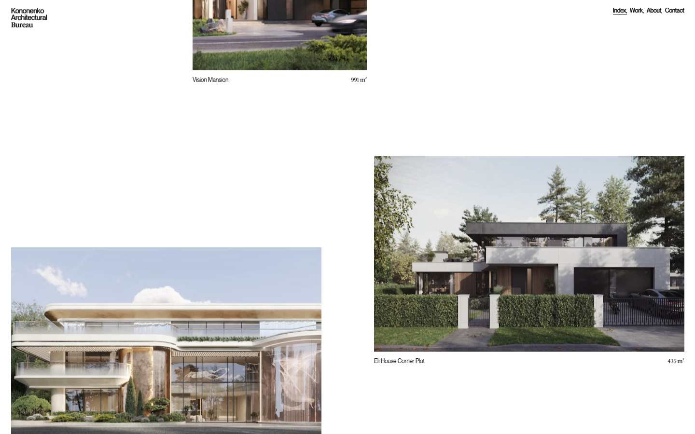

**Cambios vs anterior**
- figura mueve: a opacity 1→1 t=matrix(1, 0, 0, 1, 0, 105.698)
- figura mueve: a opacity 1→1 t=matrix(1, 0, 0, 1, 0, 34.5763)
- figura mueve: a opacity 1→1 t=matrix(1, 0, 0, 1, 0, 11.5211)

**Fondo:** `rgb(255, 255, 255)`

**Figuras / media**
- **canvas** (canvas) opacity=1
- **a** (a) opacity=1 · `matrix(1, 0, 0, 1, 0, 105.698)`
- **a** (a) opacity=1 · `matrix(1, 0, 0, 1, 0, 34.5763)`
- **img** (img) opacity=1
- **img** (img) opacity=1
- **a** (a) opacity=1 · `matrix(1, 0, 0, 1, 0, 11.5211)`

**Texto visible**
- “KononenkoArchitecturalBureau” · 14.25px n

**Sticky:** header, div, div

### Beat 18 — 56% (y=10707)

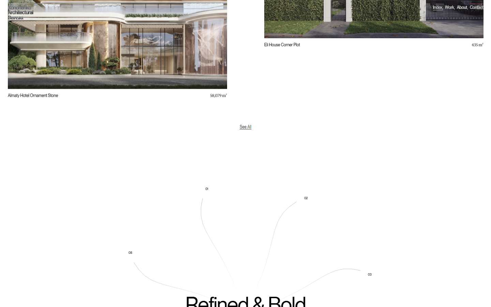

**Cambios vs anterior**
- figura mueve: a opacity 1→1 t=matrix(1, 0, 0, 1, 0, 33.8153)
- figura mueve: a opacity 1→1 t=matrix(1, 0, 0, 1, 0, 8.85824)
- figura entra: span (span)

**Fondo:** `rgb(255, 255, 255)`

**Figuras / media**
- **canvas** (canvas) opacity=1
- **a** (a) opacity=1 · `matrix(1, 0, 0, 1, 0, 33.8153)`
- **a** (a) opacity=1 · `matrix(1, 0, 0, 1, 0, 8.85824)`
- **img** (img) opacity=1
- **img** (img) opacity=1
- **span** (span) opacity=1 · `matrix(1, 0, 0, 1, 0, 0)`

**Texto visible**
- “KononenkoArchitecturalBureau” · 14.25px n

**Sticky:** header, div, div, div

### Beat 19 — 59% (y=11301)

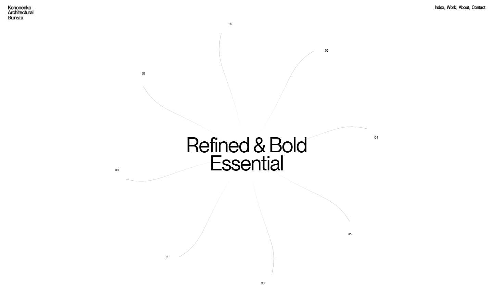

**Cambios vs anterior**
- figura mueve: span opacity 1→1 t=matrix(1, 0, 0, 1, 0, 83.325)
- texto aparece: “Refined & Bold Essential”
- texto aparece: “Simplicity & Clarity of Approach”

**Fondo:** `rgb(255, 255, 255)`

**Figuras / media**
- **canvas** (canvas) opacity=1
- **span** (span) opacity=1 · `matrix(1, 0, 0, 1, 0, 0)`
- **span** (span) opacity=1 · `matrix(1, 0, 0, 1, 0, 83.325)`

**Texto visible**
- “KononenkoArchitecturalBureau” · 14.25px n
- “Refined & Bold Essential” · 60px n
- “Simplicity & Clarity of Approach” · 60px n

**Sticky:** header, div, div, div

### Beat 20 — 63% (y=11896)

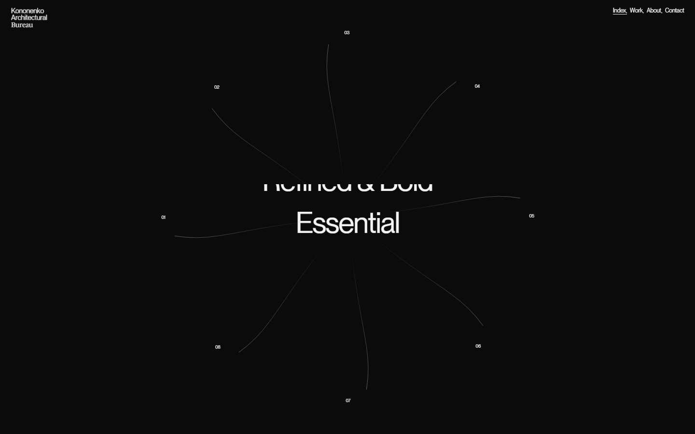

**Cambios vs anterior**
- figura mueve: span opacity 1→1 t=matrix(1, 0, 0, 1, 0, -1.77639)
- figura mueve: span opacity 1→1 t=matrix(1, 0, 0, 1, 0, -42.8027)

**Fondo:** `rgb(255, 255, 255)`

**Figuras / media**
- **canvas** (canvas) opacity=1
- **span** (span) opacity=1 · `matrix(1, 0, 0, 1, 0, -1.77639)`
- **span** (span) opacity=1 · `matrix(1, 0, 0, 1, 0, -42.8027)`
- **span** (span) opacity=1 · `matrix(1, 0, 0, 1, 0, 83.325)`

**Texto visible**
- “KononenkoArchitecturalBureau” · 14.25px n
- “Refined & Bold Essential” · 60px n
- “Simplicity & Clarity of Approach” · 60px n

**Sticky:** header, div, div, div

### Beat 21 — 66% (y=12491)

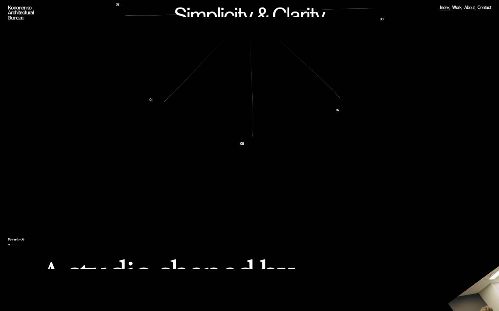

**Cambios vs anterior**
- figura mueve: span opacity 1→1 t=matrix(1, 0, 0, 1, 0, 125.13)
- figura mueve: span opacity 1→1 t=matrix(1, 0, 0, 1, 0, 91.6889)
- figura mueve: span opacity 1→1 t=matrix(1, 0, 0, 1, 0, -61.4222)
- figura mueve: span opacity 1→1 t=matrix(1, 0, 0, 1, 0, 43.825)
- texto aparece: “A studio shaped by clarity, trust, and a collectiv”

**Fondo:** `rgb(255, 255, 255)`

**Figuras / media**
- **canvas** (canvas) opacity=1
- **span** (span) opacity=1 · `matrix(1, 0, 0, 1, 0, 125.13)`
- **span** (span) opacity=1 · `matrix(1, 0, 0, 1, 0, 91.6889)`
- **span** (span) opacity=1 · `matrix(1, 0, 0, 1, 0, -61.4222)`
- **span** (span) opacity=1 · `matrix(1, 0, 0, 1, 0, 43.825)`

**Texto visible**
- “KononenkoArchitecturalBureau” · 14.25px n
- “Refined & Bold Essential” · 60px n
- “Simplicity & Clarity of Approach” · 60px n
- “A studio shaped by clarity, trust, and a collective pursuit of thoughtful design” · 88.5px h

**Sticky:** header, div, div, div

### Beat 22 — 69% (y=13086)

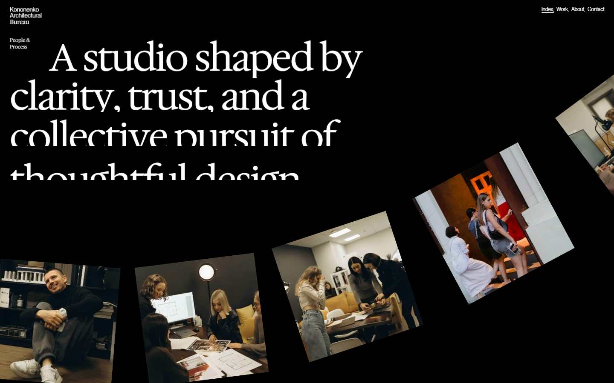

**Cambios vs anterior**
- figura mueve: span opacity 1→1 t=matrix(1, 0, 0, 1, 0, 45.084)
- figura mueve: span opacity 1→1 t=matrix(1, 0, 0, 1, 0, 68.8347)
- figura mueve: span opacity 1→1 t=matrix(1, 0, 0, 1, 0, 105.904)
- figura mueve: span opacity 1→1 t=matrix(1, 0, 0, 1, 0, 24.1499)
- texto sale: “Refined & Bold Essential”
- texto sale: “Simplicity & Clarity of Approach”

**Fondo:** `rgb(255, 255, 255)`

**Figuras / media**
- **canvas** (canvas) opacity=1
- **span** (span) opacity=1 · `matrix(1, 0, 0, 1, 0, 45.084)`
- **span** (span) opacity=1 · `matrix(1, 0, 0, 1, 0, 68.8347)`
- **span** (span) opacity=1 · `matrix(1, 0, 0, 1, 0, 105.904)`
- **span** (span) opacity=1 · `matrix(1, 0, 0, 1, 0, 24.1499)`

**Texto visible**
- “KononenkoArchitecturalBureau” · 14.25px n
- “A studio shaped by clarity, trust, and a collective pursuit of thoughtful design” · 88.5px h

**Sticky:** header, div, div

### Beat 23 — 72% (y=13681)

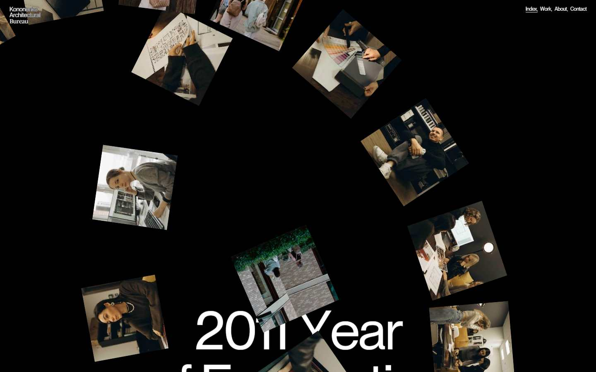

**Cambios vs anterior**
- figura mueve: span opacity 1→1 t=matrix(1, 0, 0, 1, 0, 73.2022)
- texto aparece: “2011 Year of Foundation”
- texto sale: “A studio shaped by clarity, trust, and a collectiv”

**Fondo:** `rgb(255, 255, 255)`

**Figuras / media**
- **canvas** (canvas) opacity=1
- **span** (span) opacity=1 · `matrix(1, 0, 0, 1, 0, 73.2022)`

**Texto visible**
- “KononenkoArchitecturalBureau” · 14.25px n
- “2011 Year of Foundation” · 131.25px n

**Sticky:** header, div, div

### Beat 24 — 75% (y=14276)

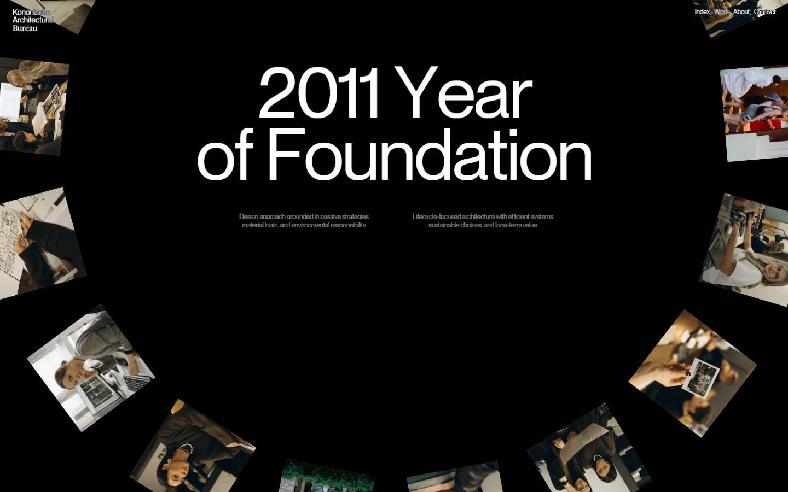

**Cambios vs anterior**
- figura mueve: span opacity 1→1 t=matrix(1, 0, 0, 1, 0, 6.46788)
- figura mueve: span opacity 1→1 t=matrix(1, 0, 0, 1, 0, 11.5842)

**Fondo:** `rgb(255, 255, 255)`

**Figuras / media**
- **canvas** (canvas) opacity=1
- **span** (span) opacity=1 · `matrix(1, 0, 0, 1, 0, 6.46788)`
- **span** (span) opacity=1 · `matrix(1, 0, 0, 1, 0, 11.5842)`

**Texto visible**
- “KononenkoArchitecturalBureau” · 14.25px n
- “2011 Year of Foundation” · 131.25px n

**Sticky:** header, div, div

### Beat 25 — 78% (y=14870)

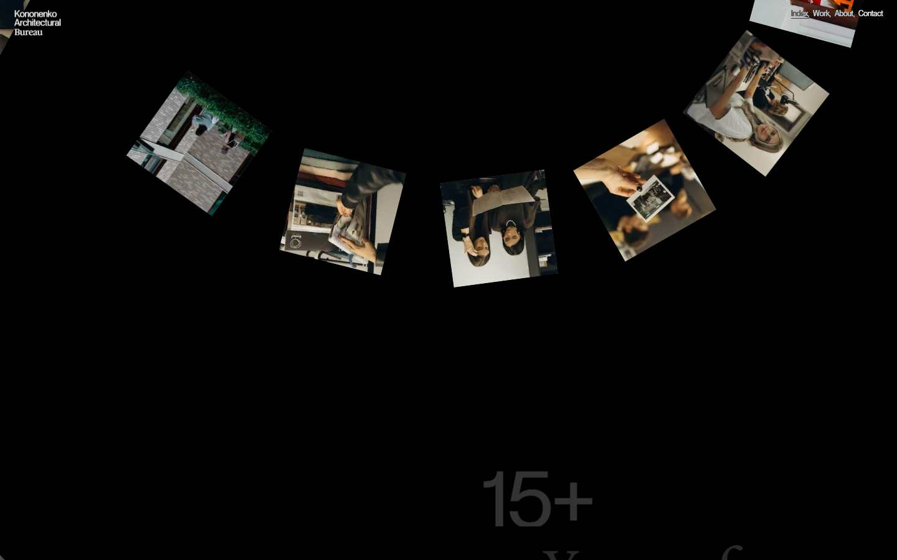

**Cambios vs anterior**
- figura mueve: span opacity 1→1 t=matrix(1, 0, 0, 1, 0, 65.9063)
- texto aparece: “15+”
- texto aparece: “Years of experience”
- texto sale: “2011 Year of Foundation”

**Fondo:** `rgb(255, 255, 255)`

**Figuras / media**
- **canvas** (canvas) opacity=1
- **span** (span) opacity=1 · `matrix(1, 0, 0, 1, 0, 65.9063)`

**Texto visible**
- “KononenkoArchitecturalBureau” · 14.25px n
- “15+” · 131.25px n
- “Years of experience” · 88.5px h

**Sticky:** header, div, div

### Beat 26 — 81% (y=15465)

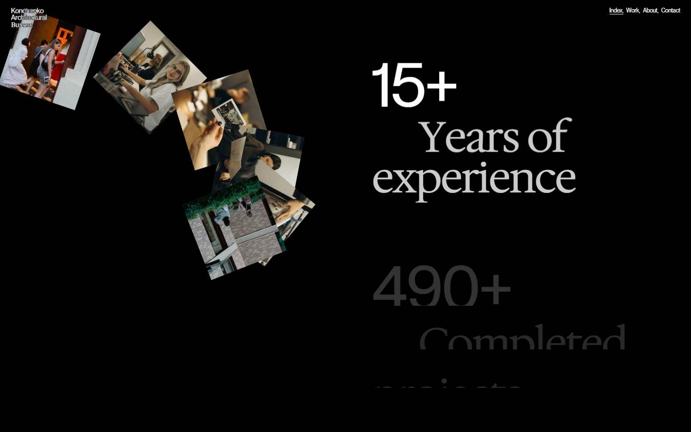

**Cambios vs anterior**
- figura mueve: span opacity 1→1 t=matrix(1, 0, 0, 1, 0, 7.87327)
- figura mueve: span opacity 1→1 t=matrix(1, 0, 0, 1, 0, 61.33)
- figura mueve: span opacity 1→1 t=matrix(1, 0, 0, 1, 0, 17.2675)
- figura mueve: span opacity 1→1 t=matrix(1, 0, 0, 1, 0, 113.574)
- figura mueve: span opacity 1→1 t=matrix(1, 0, 0, 1, 0, 10.639)
- figura mueve: span opacity 1→1 t=matrix(1, 0, 0, 1, 0, 73.6812)
- texto aparece: “490+”
- texto aparece: “Completed projects”

**Fondo:** `rgb(255, 255, 255)`

**Figuras / media**
- **canvas** (canvas) opacity=1
- **span** (span) opacity=1 · `matrix(1, 0, 0, 1, 0, 7.87327)`
- **span** (span) opacity=1 · `matrix(1, 0, 0, 1, 0, 61.33)`
- **span** (span) opacity=1 · `matrix(1, 0, 0, 1, 0, 17.2675)`
- **span** (span) opacity=1 · `matrix(1, 0, 0, 1, 0, 113.574)`
- **span** (span) opacity=1 · `matrix(1, 0, 0, 1, 0, 10.639)`

**Texto visible**
- “KononenkoArchitecturalBureau” · 14.25px n
- “15+” · 131.25px n
- “Years of experience” · 88.5px h
- “490+” · 131.25px n
- “Completed projects” · 88.5px h

**Sticky:** header, div, div

### Beat 27 — 84% (y=16060)

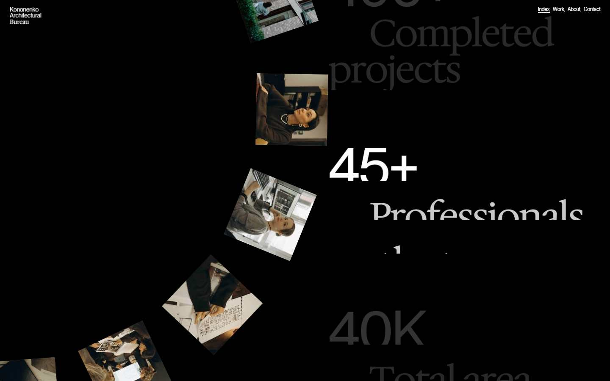

**Cambios vs anterior**
- figura mueve: span opacity 1→1 t=matrix(1, 0, 0, 1, 0, 9.43677)
- figura mueve: span opacity 1→1 t=matrix(1, 0, 0, 1, 0, 63.4445)
- figura mueve: span opacity 1→1 t=matrix(1, 0, 0, 1, 0, 63.4445)
- figura mueve: span opacity 1→1 t=matrix(1, 0, 0, 1, 0, 19.9889)
- figura mueve: span opacity 1→1 t=matrix(1, 0, 0, 1, 0, 117.704)
- figura mueve: span opacity 1→1 t=matrix(1, 0, 0, 1, 0, 12.4842)
- figura mueve: span opacity 1→1 t=matrix(1, 0, 0, 1, 0, 76.2238)
- figura mueve: span opacity 1→1 t=matrix(1, 0, 0, 1, 0, 76.2238)
- texto aparece: “45+”
- texto aparece: “Professionals on the team”
- texto aparece: “40K”
- texto aparece: “Total area covered”
- texto sale: “15+”
- texto sale: “Years of experience”
- texto sale: “490+”

**Fondo:** `rgb(255, 255, 255)`

**Figuras / media**
- **canvas** (canvas) opacity=1
- **span** (span) opacity=1 · `matrix(1, 0, 0, 1, 0, 9.43677)`
- **span** (span) opacity=1 · `matrix(1, 0, 0, 1, 0, 63.4445)`
- **span** (span) opacity=1 · `matrix(1, 0, 0, 1, 0, 63.4445)`
- **span** (span) opacity=1 · `matrix(1, 0, 0, 1, 0, 19.9889)`
- **span** (span) opacity=1 · `matrix(1, 0, 0, 1, 0, 117.704)`

**Texto visible**
- “KononenkoArchitecturalBureau” · 14.25px n
- “Completed projects” · 88.5px h
- “45+” · 131.25px n
- “Professionals on the team” · 88.5px h
- “40K” · 131.25px n
- “Total area covered” · 88.5px h

**Sticky:** header, div, div

### Beat 28 — 88% (y=16655)

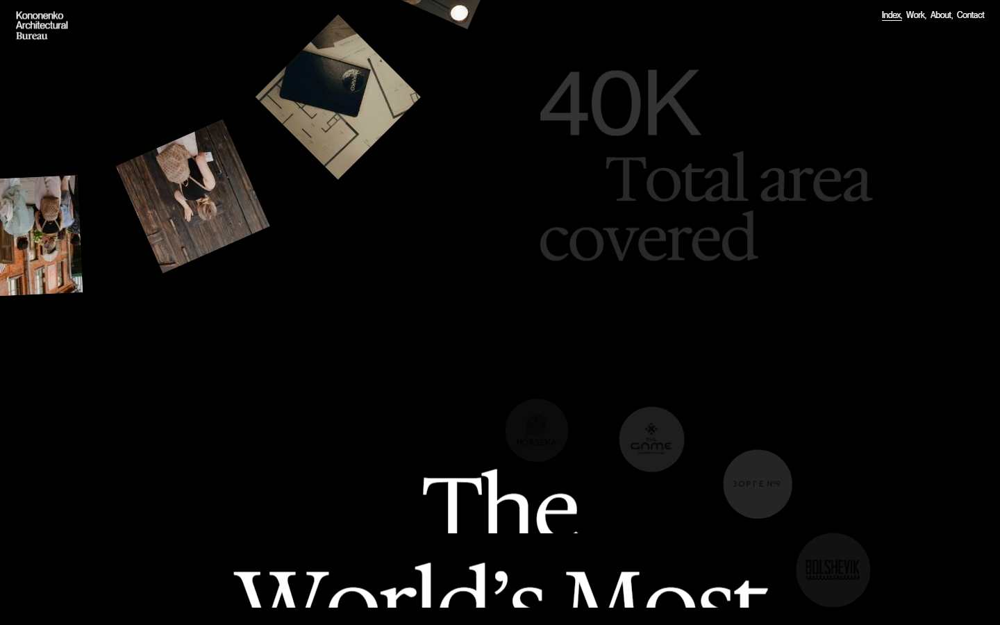

**Cambios vs anterior**
- figura mueve: span opacity 1→1 t=matrix(1, 0, 0, 1, 0, 75.4332)
- figura mueve: span opacity 1→1 t=matrix(1, 0, 0, 1, 0, 115.34)
- figura mueve: span opacity 1→1 t=matrix(1, 0, 0, 1, 0, 11.8894)
- figura mueve: span opacity 1→1 t=matrix(1, 0, 0, 1, 0, 24.2489)
- figura mueve: span opacity 1→1 t=matrix(1, 0, 0, 1, 0, 15.3605)
- figura entra: img (img)
- figura entra: div (div)
- figura entra: img (img)
- figura entra: img (img)
- figura entra: div (div)
- figura entra: img (img)
- figura entra: img (img)
- figura entra: img (img)
- texto aparece: “The World’s Most Ambitious Brands Choose to Work W”
- texto sale: “Completed projects”
- texto sale: “45+”
- texto sale: “Professionals on the team”

**Fondo:** `rgb(255, 255, 255)`

**Figuras / media**
- **canvas** (canvas) opacity=1
- **span** (span) opacity=1 · `matrix(1, 0, 0, 1, 0, 75.4332)`
- **span** (span) opacity=1 · `matrix(1, 0, 0, 1, 0, 115.34)`
- **span** (span) opacity=1 · `matrix(1, 0, 0, 1, 0, 11.8894)`
- **span** (span) opacity=1 · `matrix(1, 0, 0, 1, 0, 24.2489)`
- **span** (span) opacity=1 · `matrix(1, 0, 0, 1, 0, 15.3605)`

**Texto visible**
- “KononenkoArchitecturalBureau” · 14.25px n
- “40K” · 131.25px n
- “Total area covered” · 88.5px h
- “The World’s Most Ambitious Brands Choose to Work With Us” · 131.25px h

**Sticky:** header, div, div

### Beat 29 — 91% (y=17250)

**Cambios vs anterior**
- figura mueve: span opacity 1→1 t=matrix(1, 0, 0, 1, 0, 33.377)
- figura mueve: span opacity 1→1 t=matrix(1, 0, 0, 1, 0, 12.8422)
- figura mueve: span opacity 1→1 t=matrix(1, 0, 0, 1, 0, 21.1244)
- figura mueve: span opacity 1→1 t=matrix(1, 0, 0, 1, 0, 51.518)
- figura mueve: span opacity 1→1 t=matrix(1, 0, 0, 1, 0, 78.6807)
- figura mueve: span opacity 1→1 t=matrix(1, 0, 0, 1, 0, 120.405)
- texto sale: “40K”
- texto sale: “Total area covered”

**Fondo:** `rgb(255, 255, 255)`

**Figuras / media**
- **canvas** (canvas) opacity=1
- **span** (span) opacity=1 · `matrix(1, 0, 0, 1, 0, 33.377)`
- **span** (span) opacity=1 · `matrix(1, 0, 0, 1, 0, 12.8422)`
- **span** (span) opacity=1 · `matrix(1, 0, 0, 1, 0, 21.1244)`
- **span** (span) opacity=1 · `matrix(1, 0, 0, 1, 0, 51.518)`
- **span** (span) opacity=1 · `matrix(1, 0, 0, 1, 0, 78.6807)`

**Texto visible**
- “KononenkoArchitecturalBureau” · 14.25px n
- “The World’s Most Ambitious Brands Choose to Work With Us” · 131.25px h

**Sticky:** header, div, div

### Beat 30 — 94% (y=17844)

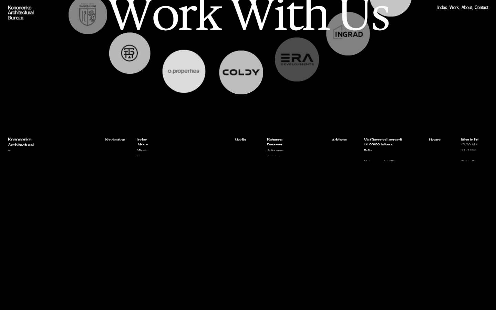

**Cambios vs anterior**
- figura mueve: span opacity 1→1 t=matrix(1, 0, 0, 1, 0, 16.8238)
- figura entra: div (div)
- figura entra: div (div)
- figura entra: div (div)
- figura entra: div (div)
- figura entra: div (div)
- figura entra: div (div)

**Fondo:** `rgb(255, 255, 255)`

**Figuras / media**
- **canvas** (canvas) opacity=1
- **span** (span) opacity=1 · `matrix(1, 0, 0, 1, 0, 16.8238)`
- **div** (div) opacity=0.103988 · `matrix(0.999973, 0, 0, 0.999973, 121.025, 358.164)`
- **img** (img) opacity=1
- **div** (div) opacity=0.534026 · `matrix(0.993084, 0, 0, 0.993084, -42.089, 390.449)`
- **img** (img) opacity=1

**Texto visible**
- “KononenkoArchitecturalBureau” · 14.25px n
- “The World’s Most Ambitious Brands Choose to Work With Us” · 131.25px h
- “KononenkoArchitecturalBureau” · 14.25px n

**Sticky:** header, div, div

### Beat 31 — 97% (y=18134)

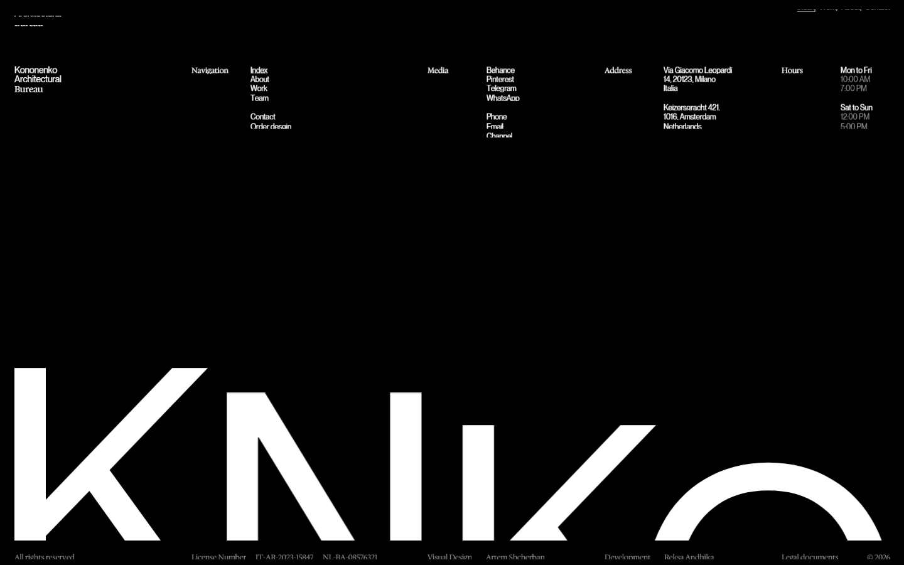

**Cambios vs anterior**
- figura entra: path (path)
- figura entra: path (path)
- figura entra: path (path)
- texto sale: “The World’s Most Ambitious Brands Choose to Work W”

**Fondo:** `rgb(255, 255, 255)`

**Figuras / media**
- **canvas** (canvas) opacity=1
- **path** (path) opacity=1 · `matrix(1, 0, 0, 1, 0, 466.732)`
- **path** (path) opacity=1 · `matrix(1, 0, 0, 1, 0, 274.489)`
- **path** (path) opacity=1 · `matrix(1, 0, 0, 1, 0, 357.18)`

**Texto visible**
- “KononenkoArchitecturalBureau” · 14.25px n
- “KononenkoArchitecturalBureau” · 14.25px n

**Sticky:** header, div, div

### Beat 32 — 100% (y=18134)

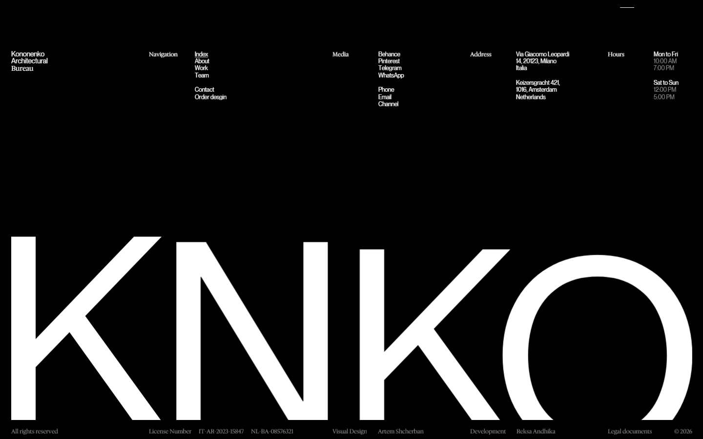

**Cambios vs anterior**
- figura mueve: path opacity 1→1 t=matrix(1, 0, 0, 1, 0, 126.293)
- figura mueve: path opacity 1→1 t=matrix(1, 0, 0, 1, 0, 95.8739)
- figura mueve: path opacity 1→1 t=matrix(1, 0, 0, 1, 0, 53.2679)
- figura mueve: path opacity 1→1 t=matrix(1, 0, 0, 1, 0, 72.0011)

**Fondo:** `rgb(255, 255, 255)`

**Figuras / media**
- **canvas** (canvas) opacity=1
- **path** (path) opacity=1 · `matrix(1, 0, 0, 1, 0, 126.293)`
- **path** (path) opacity=1 · `matrix(1, 0, 0, 1, 0, 95.8739)`
- **path** (path) opacity=1 · `matrix(1, 0, 0, 1, 0, 53.2679)`
- **path** (path) opacity=1 · `matrix(1, 0, 0, 1, 0, 72.0011)`

**Texto visible**
- “KononenkoArchitecturalBureau” · 14.25px n
- “KononenkoArchitecturalBureau” · 14.25px n

**Sticky:** header, div, div

## Anotación IA

_Sin `GEMINI_API_KEY` / `GOOGLE_API_KEY` — solo captura mecánica._

## Port a SCROLLLAB

1. Smooth scroll → `SmoothScrollProvider` (Lenis)
2. Cada beat → primitivo del cookbook (`docs/motion-cookbook.md`) + sección en `src/components/sections/atrium/`
3. Copy genérico (Headline N / Link N / lorem)
4. Actualizar [[Template reference index]] + mapa del SKU

## Gaps (llenar a mano tras mirar)

- [ ] Hero
- [ ] Sección firma (la más difícil)
- [ ] Footer

## Handoff rebuild (ago 2026)

Reconstrucción completa contra este análisis + capturas del usuario (People &
Process, anillo). Método generalizado en
[`docs/rebuild-against-reference.md`](../rebuild-against-reference.md) — escala
tipográfica en tokens (131/88.5/60/12px medidos arriba), hero de una sola foto,
hinge ClarityPair papel→tinta en un pin, PeopleScatter con rotate/drift en nodos
separados, OrbitRing con radio acotado al viewport. Pendiente: reciclaje de fotos
entre `ProjectRail` y `OrbitRing` por pool finito de assets — ver sección 6 del
playbook; no ameritó gasto de crédito Higgsfield porque el SKU sigue en
`COMING_SOON_SKUS`.
