---
tags:
  - scrolllab
  - reference-analysis
  - pear
aliases:
  - Pear (reference model) analysis
  - analyze pear
analyzed: 2026-09-09
source: https://pear.no/
beats: 28
---

# Pear (reference model) — análisis de referencia

Generado por `scripts/analyze-reference.mjs` el 2026-09-09.

**URL:** https://pear.no/  
**SKU sugerido:** `pear`  
**Title:** Pear — not an agency on the clock, a partner in the upside  
**Beats:** 28 (muestreo adaptativo; solo cambios) · maxScroll=48150px

## Librerías detectadas

- (ninguna heurística matcheó)

### Scripts (muestra)

- `https://pear.no/assets/index-BhJdAf8K.js`

### Fonts cargadas

- GT Standard L
- GT Standard Mono
- Flecha L
- Flecha M
- Flecha S

`html.class`: ``

## Técnicas inferidas

- Sticky/fixed nodes: div, video, canvas, nvm, Chapters
- Beats significativos: 28 (solo cambios de firma)

## Capas Framer (`data-framer-name`)

- (no Framer names)

## Headings

| Tag | Texto | Font | Size |
|---|---|---|---|
| H2 | No fees. A shareof the upside. | Flecha M | 77.872px |
| H2 | We say no moreoften than yes. | Flecha M | 77.872px |
| H2 | Everything it takes to befound, under one roof. | Flecha S | 23.222px |
| H2 | Search and software are onediscipline at Pear. | Flecha S | 23.222px |
| H2 | We design and build the thing beingranked: storefronts, mark | Flecha S | 23.222px |
| H1 | Pear makes you appear. | Flecha M | 77.1408px |

## Beats (fondo / figura / texto)

### Beat 0 — 0% (y=0)

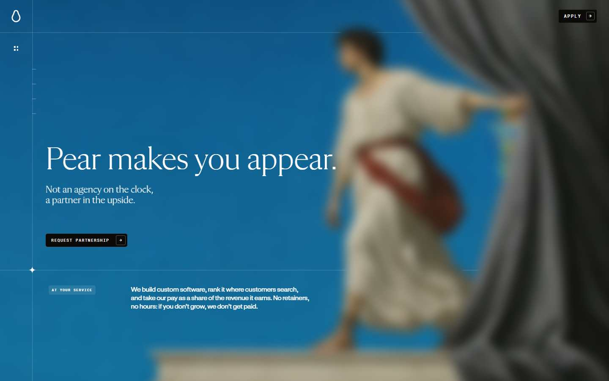

**Cambios vs anterior**
- beat inicial

**Fondo:** `rgb(11, 10, 9)`

**Figuras / media**
- **img** (img) opacity=1 · `matrix(1.1157, 0, 0, 1.1157, 0, 0)`
- **canvas** (canvas) opacity=1
- **canvas** (canvas) opacity=1
- **div** (div) opacity=1 · `matrix3d(0.810423, 0.215577, -0.469858, 0, -0.0794626, 0.900892, 0.30613`
- **div** (div) opacity=1 · `matrix(0.94987, 0, 0, 0.94987, 0, 0)`
- **div** (div) opacity=1 · `matrix(1, 0, 0, 1, 0, 0)`

**Texto visible**
- “Asked before” · 116.784px Flecha L
- “What does it cost to work with Pear?” · 26.222px Flecha M
- “What share of the revenue do you take?” · 26.222px Flecha M
- “Why revenue share instead of fees?” · 26.222px Flecha M
- “How do you measure the revenue you create?” · 26.222px Flecha M
- “How long before it pays off?” · 26.222px Flecha M

**Sticky:** div, div, video, canvas, nvm, Chapters

### Beat 1 — 3% (y=1204)

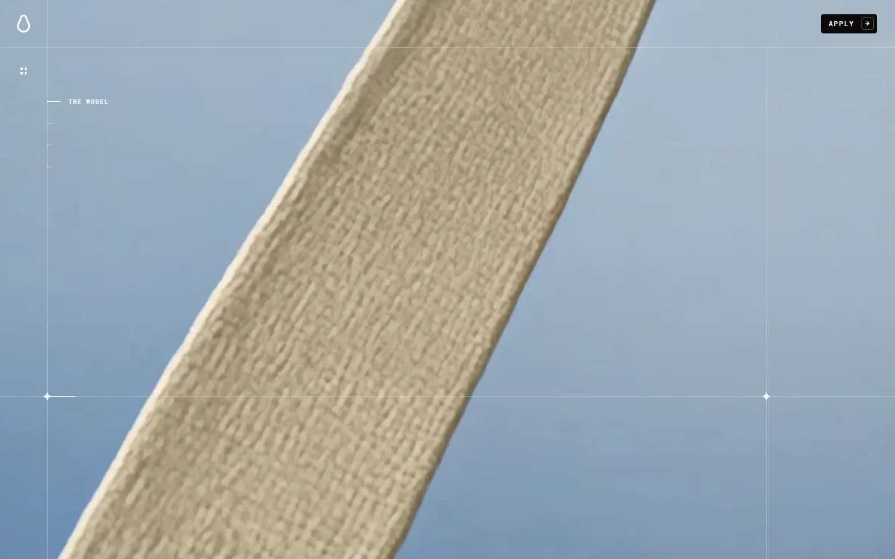

**Cambios vs anterior**
- figura mueve: img opacity 1→1 t=matrix(1.0726, 0, 0, 1.0726, 0, 0)
- figura mueve: div opacity 1→1 t=matrix3d(0.810423, 0.215577, -0.469858, 
- figura mueve: div opacity 1→1 t=matrix(0.94987, 0, 0, 0.94987, 0, 0)
- figura mueve: div opacity 1→1 t=matrix(0.94987, 0, 0, 0.94987, 0, 0)
- figura mueve: i opacity 1→1 t=matrix(1, 0, 0, 1, 0, 0)

**Fondo:** `rgb(11, 10, 9)`

**Figuras / media**
- **img** (img) opacity=1 · `matrix(1.0726, 0, 0, 1.0726, 0, 0)`
- **canvas** (canvas) opacity=1
- **div** (div) opacity=1 · `matrix3d(0.810423, 0.215577, -0.469858, 0, -0.0794626, 0.900892, 0.30613`
- **div** (div) opacity=1 · `matrix(0.94987, 0, 0, 0.94987, 0, 0)`
- **div** (div) opacity=1 · `matrix(1, 0, 0, 1, 0, 0)`
- **div** (div) opacity=1 · `matrix(1, 0, 0, 1, 0, 0)`

**Texto visible**
- “Asked before” · 116.784px Flecha L
- “What does it cost to work with Pear?” · 26.222px Flecha M
- “What share of the revenue do you take?” · 26.222px Flecha M
- “Why revenue share instead of fees?” · 26.222px Flecha M
- “How do you measure the revenue you create?” · 26.222px Flecha M
- “How long before it pays off?” · 26.222px Flecha M

**Sticky:** div, div, video, canvas, nvm, Chapters

### Beat 2 — 5% (y=2408)

**Cambios vs anterior**
- figura mueve: div opacity 1→1 t=matrix3d(0.810423, 0.215577, -0.469858, 
- figura mueve: div opacity 1→1 t=matrix(0.94987, 0, 0, 0.94987, 0, 0)
- figura mueve: div opacity 1→1 t=matrix(0.94987, 0, 0, 0.94987, 0, 0)
- figura mueve: i opacity 1→1 t=matrix(1, 0, 0, 1, 0, 0)

**Fondo:** `rgb(11, 10, 9)`

**Figuras / media**
- **canvas** (canvas) opacity=1
- **div** (div) opacity=1 · `matrix3d(0.810423, 0.215577, -0.469858, 0, -0.0794626, 0.900892, 0.30613`
- **div** (div) opacity=1 · `matrix(0.94987, 0, 0, 0.94987, 0, 0)`
- **div** (div) opacity=1 · `matrix(1, 0, 0, 1, 0, 0)`
- **div** (div) opacity=1 · `matrix(1, 0, 0, 1, 0, 0)`
- **div** (div) opacity=1 · `matrix(0.94987, 0, 0, 0.94987, 0, 0)`

**Texto visible**
- “Asked before” · 116.784px Flecha L
- “What does it cost to work with Pear?” · 26.222px Flecha M
- “What share of the revenue do you take?” · 26.222px Flecha M
- “Why revenue share instead of fees?” · 26.222px Flecha M
- “How do you measure the revenue you create?” · 26.222px Flecha M
- “How long before it pays off?” · 26.222px Flecha M

**Sticky:** div, div, video, canvas, nvm, Chapters

### Beat 3 — 8% (y=3611)

**Cambios vs anterior**
- figura mueve: div opacity 1→1 t=matrix3d(0.810423, 0.215577, -0.469858, 
- figura mueve: div opacity 1→1 t=matrix(0.94987, 0, 0, 0.94987, 0, 0)
- figura mueve: div opacity 1→1 t=matrix(0.94987, 0, 0, 0.94987, 0, 0)
- figura mueve: i opacity 1→1 t=matrix(1, 0, 0, 1, 0, 0)
- figura mueve: i opacity 1→1 t=matrix(1, 0, 0, 1, 0, 0)

**Fondo:** `rgb(11, 10, 9)`

**Figuras / media**
- **canvas** (canvas) opacity=1
- **div** (div) opacity=1 · `matrix3d(0.810423, 0.215577, -0.469858, 0, -0.0794626, 0.900892, 0.30613`
- **div** (div) opacity=1 · `matrix(0.94987, 0, 0, 0.94987, 0, 0)`
- **div** (div) opacity=1 · `matrix(1, 0, 0, 1, 0, 0)`
- **div** (div) opacity=1 · `matrix(1, 0, 0, 1, 0, 0)`
- **div** (div) opacity=1 · `matrix(0.94987, 0, 0, 0.94987, 0, 0)`

**Texto visible**
- “Asked before” · 116.784px Flecha L
- “What does it cost to work with Pear?” · 26.222px Flecha M
- “What share of the revenue do you take?” · 26.222px Flecha M
- “Why revenue share instead of fees?” · 26.222px Flecha M
- “How do you measure the revenue you create?” · 26.222px Flecha M
- “How long before it pays off?” · 26.222px Flecha M

**Sticky:** div, div, video, canvas, nvm, Chapters

### Beat 4 — 10% (y=4815)

**Cambios vs anterior**
- figura mueve: div opacity 1→1 t=matrix3d(0.810423, 0.215577, -0.469858, 
- figura mueve: div opacity 1→1 t=matrix(0.94987, 0, 0, 0.94987, 0, 0)
- figura mueve: div opacity 1→1 t=matrix(0.94987, 0, 0, 0.94987, 0, 0)
- figura mueve: i opacity 1→1 t=matrix(1, 0, 0, 1, 0, 82.2562)
- figura mueve: i opacity 1→1 t=matrix(1, 0, 0, 1, 0, 82.2562)
- figura mueve: i opacity 1→1 t=matrix(1, 0, 0, 1, 0, 3.15246)

**Fondo:** `rgb(11, 10, 9)`

**Figuras / media**
- **canvas** (canvas) opacity=1
- **div** (div) opacity=1 · `matrix3d(0.810423, 0.215577, -0.469858, 0, -0.0794626, 0.900892, 0.30613`
- **div** (div) opacity=1 · `matrix(0.94987, 0, 0, 0.94987, 0, 0)`
- **div** (div) opacity=1 · `matrix(1, 0, 0, 1, 0, 0)`
- **div** (div) opacity=1 · `matrix(1, 0, 0, 1, 0, 0)`
- **div** (div) opacity=1 · `matrix(0.94987, 0, 0, 0.94987, 0, 0)`

**Texto visible**
- “Asked before” · 116.784px Flecha L
- “What does it cost to work with Pear?” · 26.222px Flecha M
- “What share of the revenue do you take?” · 26.222px Flecha M
- “Why revenue share instead of fees?” · 26.222px Flecha M
- “How do you measure the revenue you create?” · 26.222px Flecha M
- “How long before it pays off?” · 26.222px Flecha M

**Sticky:** div, div, video, canvas, nvm, Chapters

### Beat 5 — 13% (y=6019)

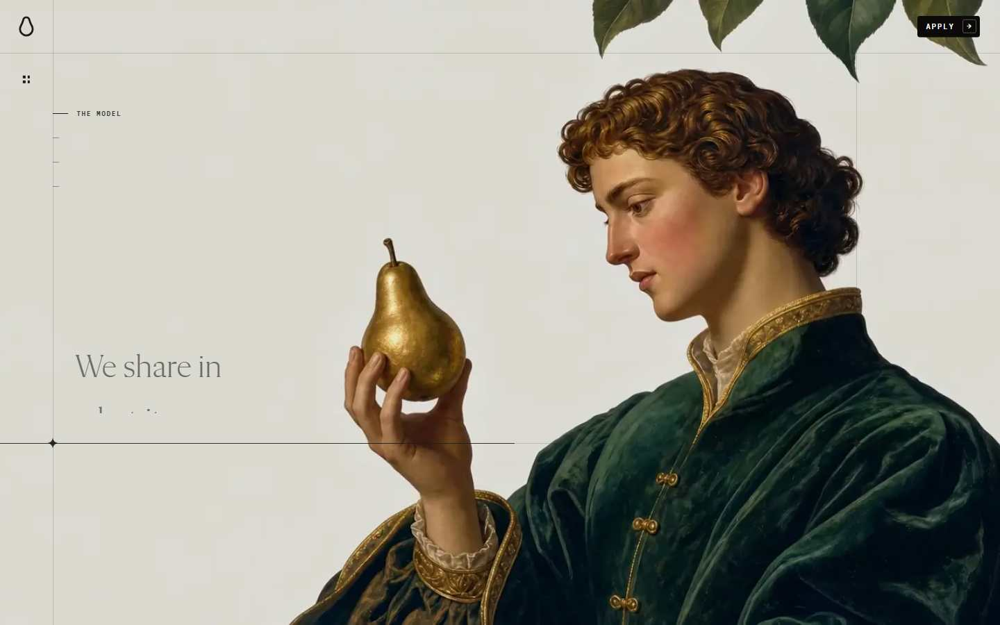

**Cambios vs anterior**
- figura mueve: div opacity 1→1 t=matrix3d(0.810423, 0.215577, -0.469858, 
- figura mueve: div opacity 1→1 t=matrix(0.94987, 0, 0, 0.94987, 0, 0)
- figura mueve: div opacity 1→1 t=matrix(0.94987, 0, 0, 0.94987, 0, 0)
- figura mueve: i opacity 1→1 t=matrix(1, 0, 0, 1, 0, 0)
- figura mueve: i opacity 1→1 t=matrix(1, 0, 0, 1, 0, 82.2562)
- figura mueve: i opacity 1→1 t=matrix(1, 0, 0, 1, 0, 82.2562)
- figura mueve: i opacity 1→1 t=matrix(1, 0, 0, 1, 0, 46.5677)
- figura mueve: i opacity 1→1 t=matrix(1, 0, 0, 1, 0, 17.1821)

**Fondo:** `rgb(11, 10, 9)`

**Figuras / media**
- **canvas** (canvas) opacity=1
- **div** (div) opacity=1 · `matrix3d(0.810423, 0.215577, -0.469858, 0, -0.0794626, 0.900892, 0.30613`
- **div** (div) opacity=1 · `matrix(0.94987, 0, 0, 0.94987, 0, 0)`
- **div** (div) opacity=1 · `matrix(1, 0, 0, 1, 0, 0)`
- **div** (div) opacity=1 · `matrix(1, 0, 0, 1, 0, 0)`
- **div** (div) opacity=1 · `matrix(0.94987, 0, 0, 0.94987, 0, 0)`

**Texto visible**
- “Asked before” · 116.784px Flecha L
- “What does it cost to work with Pear?” · 26.222px Flecha M
- “What share of the revenue do you take?” · 26.222px Flecha M
- “Why revenue share instead of fees?” · 26.222px Flecha M
- “How do you measure the revenue you create?” · 26.222px Flecha M
- “How long before it pays off?” · 26.222px Flecha M

**Sticky:** div, div, video, canvas, nvm, Chapters

### Beat 6 — 18% (y=8426)

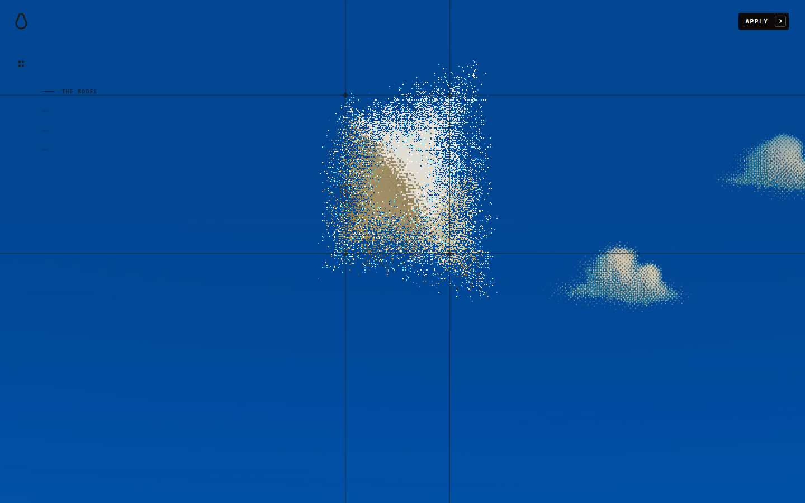

**Cambios vs anterior**
- figura mueve: div opacity 1→1 t=matrix(1.08434, 0, 0, 1.08434, 0, 0)
- figura mueve: div opacity 1→1 t=matrix3d(0.810423, 0.215577, -0.469858, 
- figura mueve: div opacity 1→1 t=matrix(0.94987, 0, 0, 0.94987, 0, 0)
- figura mueve: div opacity 1→1 t=matrix(0.94987, 0, 0, 0.94987, 0, 0)
- figura mueve: i opacity 1→1 t=matrix(1, 0, 0, 1, 0, 0)
- figura mueve: i opacity 1→1 t=matrix(1, 0, 0, 1, 0, 82.2562)
- figura mueve: i opacity 1→1 t=matrix(1, 0, 0, 1, 0, 82.2562)
- figura mueve: i opacity 1→1 t=matrix(1, 0, 0, 1, 0, 46.5677)
- texto aparece: “Not an agency on the clock,a partner in the upside”
- texto sale: “The product is built to rank from its first commit”

**Fondo:** `rgb(11, 10, 9)`

**Figuras / media**
- **div** (div) opacity=1 · `matrix(1.08434, 0, 0, 1.08434, 0, 0)`
- **canvas** (canvas) opacity=1
- **div** (div) opacity=1 · `matrix3d(0.810423, 0.215577, -0.469858, 0, -0.0794626, 0.900892, 0.30613`
- **div** (div) opacity=1 · `matrix(0.94987, 0, 0, 0.94987, 0, 0)`
- **div** (div) opacity=1 · `matrix(1, 0, 0, 1, 0, 0)`
- **div** (div) opacity=1 · `matrix(1, 0, 0, 1, 0, 0)`

**Texto visible**
- “Asked before” · 116.784px Flecha L
- “What does it cost to work with Pear?” · 26.222px Flecha M
- “What share of the revenue do you take?” · 26.222px Flecha M
- “Why revenue share instead of fees?” · 26.222px Flecha M
- “How do you measure the revenue you create?” · 26.222px Flecha M
- “How long before it pays off?” · 26.222px Flecha M

**Sticky:** div, div, video, canvas, nvm, Chapters

### Beat 7 — 20% (y=9630)

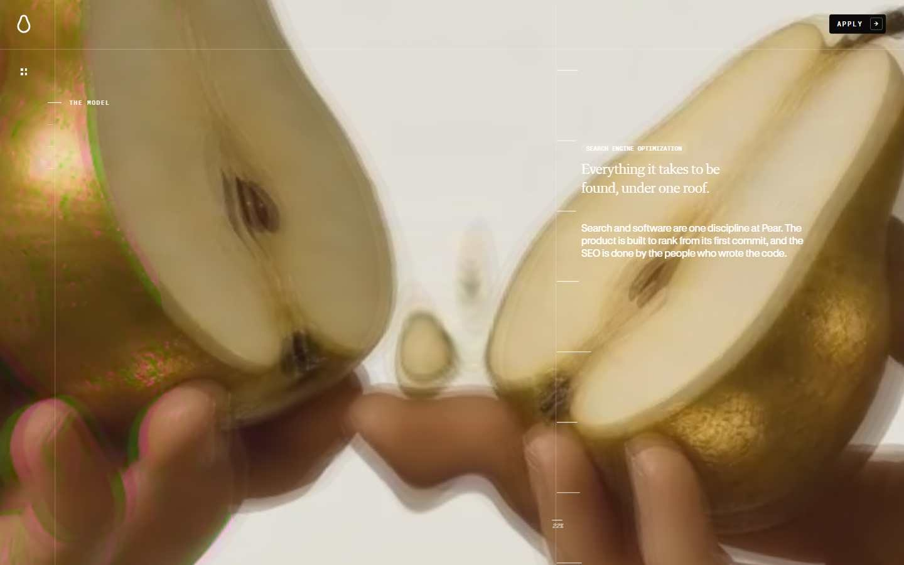

**Cambios vs anterior**
- figura mueve: div opacity 1→1 t=matrix(1.08434, 0, 0, 1.08434, 0, 0)
- figura mueve: div opacity 1→1 t=matrix3d(0.810423, 0.215577, -0.469858, 
- figura mueve: div opacity 1→1 t=matrix(0.94987, 0, 0, 0.94987, 0, 0)
- figura mueve: div opacity 1→1 t=matrix(0.94987, 0, 0, 0.94987, 0, 0)
- figura mueve: div opacity 1→0.605 t=matrix(1, 0, 0, 1, 0, -282.4)
- figura mueve: i opacity 1→1 t=matrix(1, 0, 0, 1, 0, 0)
- figura mueve: i opacity 1→1 t=matrix(1, 0, 0, 1, 0, 82.2562)
- figura mueve: i opacity 1→1 t=matrix(1, 0, 0, 1, 0, 82.2562)

**Fondo:** `rgb(11, 10, 9)`

**Figuras / media**
- **div** (div) opacity=1 · `matrix(1.08434, 0, 0, 1.08434, 0, 0)`
- **canvas** (canvas) opacity=1
- **div** (div) opacity=1 · `matrix3d(0.810423, 0.215577, -0.469858, 0, -0.0794626, 0.900892, 0.30613`
- **div** (div) opacity=1 · `matrix(0.94987, 0, 0, 0.94987, 0, 0)`
- **div** (div) opacity=1 · `matrix(1, 0, 0, 1, 0, 0)`
- **div** (div) opacity=1 · `matrix(1, 0, 0, 1, 0, 0)`

**Texto visible**
- “Asked before” · 116.784px Flecha L
- “What does it cost to work with Pear?” · 26.222px Flecha M
- “What share of the revenue do you take?” · 26.222px Flecha M
- “Why revenue share instead of fees?” · 26.222px Flecha M
- “How do you measure the revenue you create?” · 26.222px Flecha M
- “How long before it pays off?” · 26.222px Flecha M

**Sticky:** div, div, video, canvas, nvm, Chapters

### Beat 8 — 23% (y=10834)

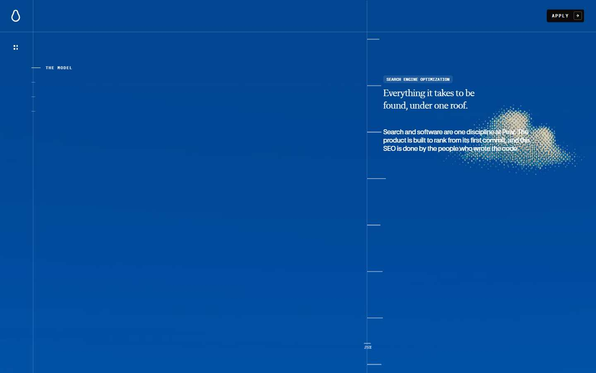

**Cambios vs anterior**
- figura mueve: div opacity 1→1 t=matrix(1.08434, 0, 0, 1.08434, 0, -129.5
- figura mueve: div opacity 1→1 t=matrix3d(0.810423, 0.215577, -0.469858, 
- figura mueve: div opacity 1→1 t=matrix(0.94987, 0, 0, 0.94987, 0, 0)
- figura mueve: div opacity 1→1 t=matrix(0.94987, 0, 0, 0.94987, 0, 0)
- figura mueve: div opacity 1→1 t=matrix(1, 0, 0, 1, 0, -331.2)
- figura mueve: i opacity 1→1 t=matrix(1, 0, 0, 1, 0, 0)

**Fondo:** `rgb(11, 10, 9)`

**Figuras / media**
- **div** (div) opacity=1 · `matrix(1.08434, 0, 0, 1.08434, 0, -129.58)`
- **canvas** (canvas) opacity=1
- **div** (div) opacity=1 · `matrix3d(0.810423, 0.215577, -0.469858, 0, -0.0794626, 0.900892, 0.30613`
- **div** (div) opacity=1 · `matrix(0.94987, 0, 0, 0.94987, 0, 0)`
- **div** (div) opacity=1 · `matrix(1, 0, 0, 1, 0, 0)`
- **div** (div) opacity=1 · `matrix(1, 0, 0, 1, 0, 0)`

**Texto visible**
- “Asked before” · 116.784px Flecha L
- “What does it cost to work with Pear?” · 26.222px Flecha M
- “What share of the revenue do you take?” · 26.222px Flecha M
- “Why revenue share instead of fees?” · 26.222px Flecha M
- “How do you measure the revenue you create?” · 26.222px Flecha M
- “How long before it pays off?” · 26.222px Flecha M

**Sticky:** div, div, video, canvas, nvm, Chapters

### Beat 9 — 25% (y=12038)

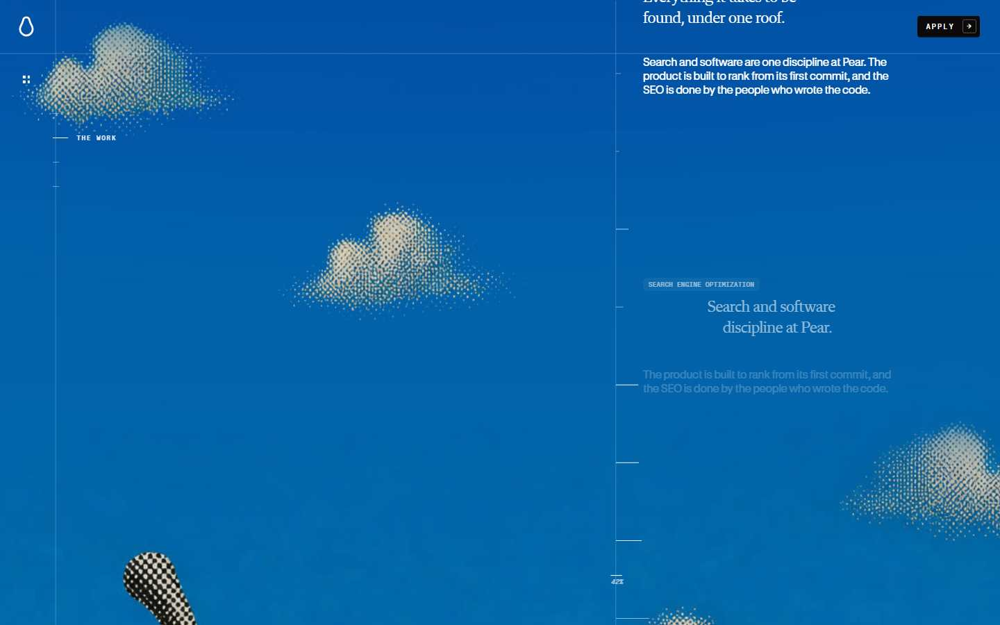

**Cambios vs anterior**
- figura mueve: div opacity 1→1 t=matrix(1.08434, 0, 0, 1.08434, 0, -791.0
- figura mueve: div opacity 1→1 t=matrix3d(0.810423, 0.215577, -0.469858, 
- figura mueve: div opacity 1→1 t=matrix(0.94987, 0, 0, 0.94987, 0, 0)
- figura mueve: div opacity 1→1 t=matrix(0.94987, 0, 0, 0.94987, 0, 0)
- figura mueve: div opacity 1→1 t=matrix(1, 0, 0, 1, 0, -559.9)
- figura mueve: div opacity 1→0.065 t=matrix(1, 0, 0, 1, 0, -108.1)
- figura mueve: i opacity 1→1 t=matrix(1, 0, 0, 1, 0, 0)

**Fondo:** `rgb(11, 10, 9)`

**Figuras / media**
- **div** (div) opacity=1 · `matrix(1.08434, 0, 0, 1.08434, 0, -791.05)`
- **canvas** (canvas) opacity=1
- **div** (div) opacity=1 · `matrix3d(0.810423, 0.215577, -0.469858, 0, -0.0794626, 0.900892, 0.30613`
- **div** (div) opacity=1 · `matrix(0.94987, 0, 0, 0.94987, 0, 0)`
- **div** (div) opacity=1 · `matrix(1, 0, 0, 1, 0, 0)`
- **div** (div) opacity=1 · `matrix(1, 0, 0, 1, 0, 0)`

**Texto visible**
- “Asked before” · 116.784px Flecha L
- “What does it cost to work with Pear?” · 26.222px Flecha M
- “What share of the revenue do you take?” · 26.222px Flecha M
- “Why revenue share instead of fees?” · 26.222px Flecha M
- “How do you measure the revenue you create?” · 26.222px Flecha M
- “How long before it pays off?” · 26.222px Flecha M

**Sticky:** div, div, video, canvas, nvm, Chapters

### Beat 10 — 28% (y=13241)

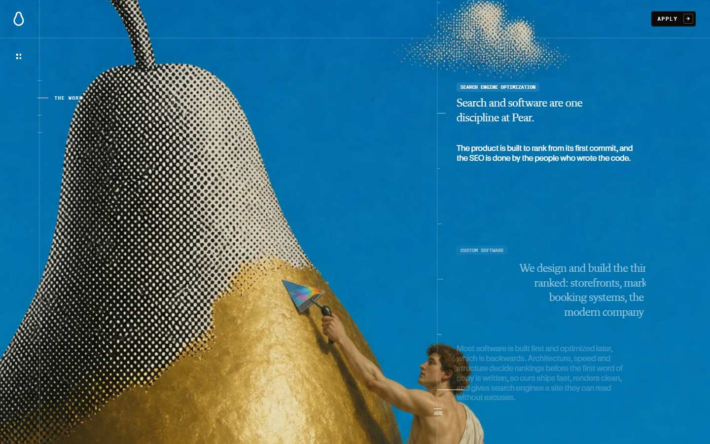

**Cambios vs anterior**
- figura mueve: div opacity 1→1 t=matrix(1.08434, 0, 0, 1.08434, 0, -1451.
- figura mueve: div opacity 1→1 t=matrix3d(0.810423, 0.215577, -0.469858, 
- figura mueve: div opacity 1→1 t=matrix(0.94987, 0, 0, 0.94987, 0, 0)
- figura mueve: div opacity 1→1 t=matrix(0.94987, 0, 0, 0.94987, 0, 0)
- figura mueve: div opacity 1→0.065 t=matrix(1, 0, 0, 1, 0, -10.4)
- figura mueve: div opacity 1→0.946 t=matrix(1, 0, 0, 1, 0, -345.4)
- figura mueve: i opacity 1→1 t=matrix(1, 0, 0, 1, 0, 0)
- texto aparece: “The product is built to rank from its first commit”
- texto sale: “Everything it takes to befound, under one roof.”

**Fondo:** `rgb(11, 10, 9)`

**Figuras / media**
- **div** (div) opacity=1 · `matrix(1.08434, 0, 0, 1.08434, 0, -1451.97)`
- **canvas** (canvas) opacity=1
- **div** (div) opacity=1 · `matrix3d(0.810423, 0.215577, -0.469858, 0, -0.0794626, 0.900892, 0.30613`
- **div** (div) opacity=1 · `matrix(0.94987, 0, 0, 0.94987, 0, 0)`
- **div** (div) opacity=1 · `matrix(1, 0, 0, 1, 0, 0)`
- **div** (div) opacity=1 · `matrix(1, 0, 0, 1, 0, 0)`

**Texto visible**
- “Asked before” · 116.784px Flecha L
- “What does it cost to work with Pear?” · 26.222px Flecha M
- “What share of the revenue do you take?” · 26.222px Flecha M
- “Why revenue share instead of fees?” · 26.222px Flecha M
- “How do you measure the revenue you create?” · 26.222px Flecha M
- “How long before it pays off?” · 26.222px Flecha M

**Sticky:** div, div, video, canvas, nvm, Chapters

### Beat 11 — 30% (y=14445)

**Cambios vs anterior**
- figura mueve: div opacity 1→1 t=matrix(1.08434, 0, 0, 1.08434, 0, -2113.
- figura mueve: div opacity 1→1 t=matrix3d(0.810423, 0.215577, -0.469858, 
- figura mueve: div opacity 1→1 t=matrix(0.94987, 0, 0, 0.94987, 0, 0)
- figura mueve: div opacity 1→1 t=matrix(0.94987, 0, 0, 0.94987, 0, 0)
- figura mueve: div opacity 1→0.946 t=matrix(1, 0, 0, 1, 0, -248)
- figura mueve: div opacity 1→1 t=matrix(1, 0, 0, 1, 0, -574.7)
- figura mueve: i opacity 1→1 t=matrix(1, 0, 0, 1, 0, 0)
- figura mueve: p opacity 1→0.922 t=matrix(1, 0, 0, 1, 0, 0.8)
- texto aparece: “Tailored software, built to be found.”
- texto sale: “Search and software are onediscipline at Pear.”

**Fondo:** `rgb(11, 10, 9)`

**Figuras / media**
- **div** (div) opacity=1 · `matrix(1.08434, 0, 0, 1.08434, 0, -2113.44)`
- **canvas** (canvas) opacity=1
- **div** (div) opacity=1 · `matrix3d(0.810423, 0.215577, -0.469858, 0, -0.0794626, 0.900892, 0.30613`
- **div** (div) opacity=1 · `matrix(0.94987, 0, 0, 0.94987, 0, 0)`
- **div** (div) opacity=1 · `matrix(1, 0, 0, 1, 0, 0)`
- **div** (div) opacity=1 · `matrix(1, 0, 0, 1, 0, 0)`

**Texto visible**
- “Asked before” · 116.784px Flecha L
- “What does it cost to work with Pear?” · 26.222px Flecha M
- “What share of the revenue do you take?” · 26.222px Flecha M
- “Why revenue share instead of fees?” · 26.222px Flecha M
- “How do you measure the revenue you create?” · 26.222px Flecha M
- “How long before it pays off?” · 26.222px Flecha M

**Sticky:** div, div, video, canvas, nvm, Chapters

### Beat 12 — 33% (y=15649)

**Cambios vs anterior**
- figura mueve: div opacity 1→1 t=matrix(1.08434, 0, 0, 1.08434, 0, -2774.
- figura mueve: div opacity 1→1 t=matrix3d(0.810423, 0.215577, -0.469858, 
- figura mueve: div opacity 1→1 t=matrix(0.94987, 0, 0, 0.94987, 0, 0)
- figura mueve: div opacity 1→1 t=matrix(0.94987, 0, 0, 0.94987, 0, 0)
- figura mueve: div opacity 1→1 t=matrix(1, 0, 0, 1, 0, -477.3)
- figura mueve: i opacity 1→1 t=matrix(1, 0, 0, 1, 0, 82.2562)
- texto aparece: “Search and links that put you in front of the crow”
- texto sale: “The product is built to rank from its first commit”

**Fondo:** `rgb(11, 10, 9)`

**Figuras / media**
- **div** (div) opacity=1 · `matrix(1.08434, 0, 0, 1.08434, 0, -2774.91)`
- **canvas** (canvas) opacity=1
- **div** (div) opacity=1 · `matrix3d(0.810423, 0.215577, -0.469858, 0, -0.0794626, 0.900892, 0.30613`
- **div** (div) opacity=1 · `matrix(0.94987, 0, 0, 0.94987, 0, 0)`
- **div** (div) opacity=1 · `matrix(1, 0, 0, 1, 0, 0)`
- **div** (div) opacity=1 · `matrix(1, 0, 0, 1, 0, 0)`

**Texto visible**
- “Asked before” · 116.784px Flecha L
- “What does it cost to work with Pear?” · 26.222px Flecha M
- “What share of the revenue do you take?” · 26.222px Flecha M
- “Why revenue share instead of fees?” · 26.222px Flecha M
- “How do you measure the revenue you create?” · 26.222px Flecha M
- “How long before it pays off?” · 26.222px Flecha M

**Sticky:** div, div, video, canvas, nvm, Chapters

### Beat 13 — 45% (y=21668)

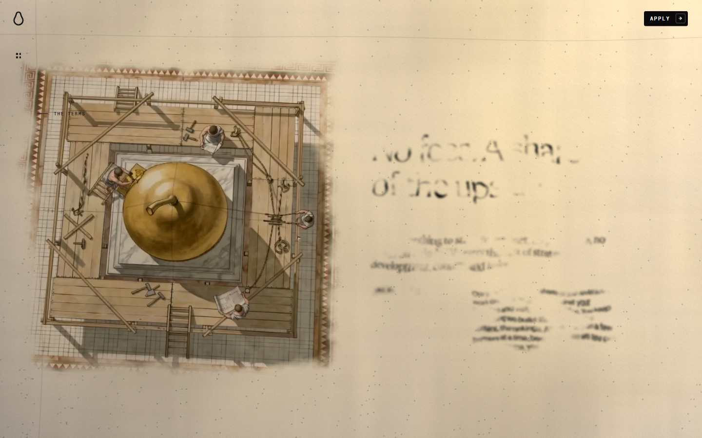

**Cambios vs anterior**
- figura mueve: div opacity 1→1 t=matrix(1.08434, 0, 0, 1.08434, 0, -2774.
- figura mueve: div opacity 1→1 t=matrix3d(0.810423, 0.215577, -0.469858, 
- figura mueve: div opacity 1→1 t=matrix(0.94987, 0, 0, 0.94987, 0, 0)
- figura mueve: div opacity 1→1 t=matrix(0.94987, 0, 0, 0.94987, 0, 0)
- figura mueve: div opacity 1→1 t=matrix(1, 0, 0, 1, 0, -477.3)
- figura mueve: i opacity 1→1 t=matrix(1, 0, 0, 1, 0, 0)
- figura mueve: i opacity 1→1 t=matrix(1, 0, 0, 1, 0, 0)

**Fondo:** `rgb(11, 10, 9)`

**Figuras / media**
- **div** (div) opacity=1 · `matrix(1.08434, 0, 0, 1.08434, 0, -2774.91)`
- **canvas** (canvas) opacity=1
- **div** (div) opacity=1 · `matrix3d(0.810423, 0.215577, -0.469858, 0, -0.0794626, 0.900892, 0.30613`
- **div** (div) opacity=1 · `matrix(0.94987, 0, 0, 0.94987, 0, 0)`
- **div** (div) opacity=1 · `matrix(1, 0, 0, 1, 0, 0)`
- **div** (div) opacity=1 · `matrix(1, 0, 0, 1, 0, 0)`

**Texto visible**
- “Asked before” · 116.784px Flecha L
- “What does it cost to work with Pear?” · 26.222px Flecha M
- “What share of the revenue do you take?” · 26.222px Flecha M
- “Why revenue share instead of fees?” · 26.222px Flecha M
- “How do you measure the revenue you create?” · 26.222px Flecha M
- “How long before it pays off?” · 26.222px Flecha M

**Sticky:** div, div, video, canvas, nvm, Chapters

### Beat 14 — 53% (y=25279)

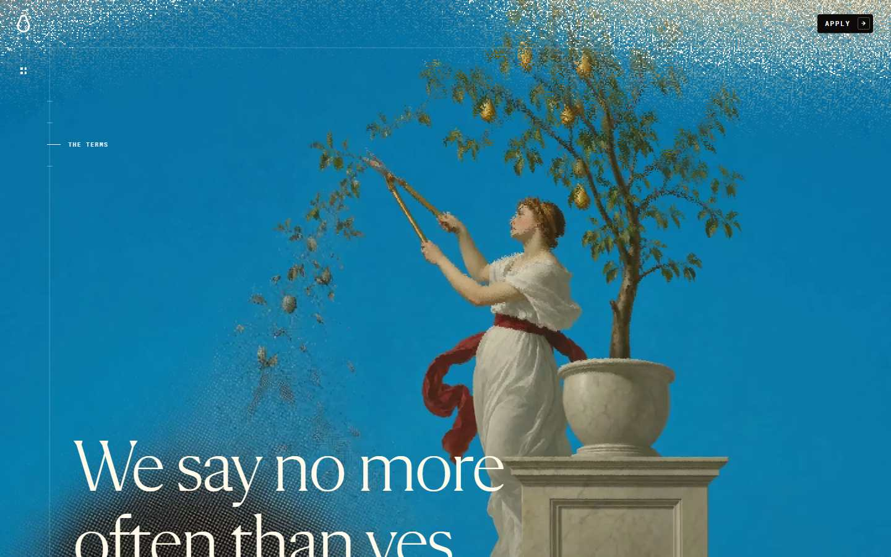

**Cambios vs anterior**
- figura mueve: div opacity 1→1 t=matrix(1.08434, 0, 0, 1.08434, 0, -2774.
- figura mueve: div opacity 1→1 t=matrix3d(0.810423, 0.215577, -0.469858, 
- figura mueve: div opacity 1→1 t=matrix(1.53879, 0, 0, 1.53879, 0, 609.81
- figura mueve: div opacity 1→1 t=matrix(0.94987, 0, 0, 0.94987, 0, 0)
- figura mueve: div opacity 1→1 t=matrix(0.94987, 0, 0, 0.94987, 0, 0)
- figura mueve: div opacity 1→1 t=matrix(1, 0, 0, 1, 0, -477.3)
- texto aparece: “We say no moreoften than yes.”
- texto sale: “Search and links that put you in front of the crow”

**Fondo:** `rgb(11, 10, 9)`

**Figuras / media**
- **div** (div) opacity=1 · `matrix(1.08434, 0, 0, 1.08434, 0, -2774.91)`
- **canvas** (canvas) opacity=1
- **div** (div) opacity=1 · `matrix3d(0.810423, 0.215577, -0.469858, 0, -0.0794626, 0.900892, 0.30613`
- **div** (div) opacity=1 · `matrix(1.53879, 0, 0, 1.53879, 0, 609.817)`
- **div** (div) opacity=1 · `matrix(0.94987, 0, 0, 0.94987, 0, 0)`
- **div** (div) opacity=1 · `matrix(1, 0, 0, 1, 0, 0)`

**Texto visible**
- “Asked before” · 116.784px Flecha L
- “What does it cost to work with Pear?” · 26.222px Flecha M
- “What share of the revenue do you take?” · 26.222px Flecha M
- “Why revenue share instead of fees?” · 26.222px Flecha M
- “How do you measure the revenue you create?” · 26.222px Flecha M
- “How long before it pays off?” · 26.222px Flecha M

**Sticky:** div, div, video, canvas, nvm, Chapters

### Beat 15 — 55% (y=26483)

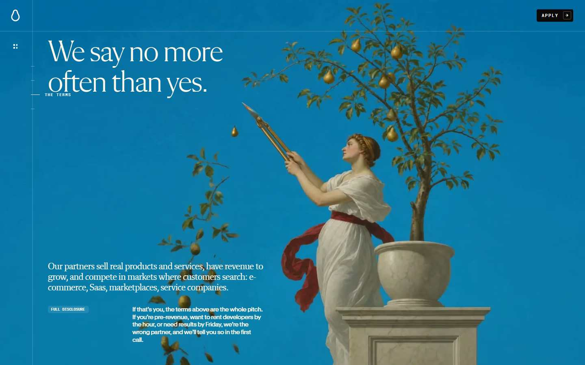

**Cambios vs anterior**
- figura mueve: div opacity 1→1 t=matrix(1.08434, 0, 0, 1.08434, 0, -2774.
- figura mueve: div opacity 1→1 t=matrix3d(0.810423, 0.215577, -0.469858, 
- figura mueve: div opacity 1→1 t=matrix(0.94987, 0, 0, 0.94987, 0, 0)
- figura mueve: div opacity 1→1 t=matrix(1, 0, 0, 1, 0, 0)
- figura mueve: div opacity 1→1 t=matrix(0.94987, 0, 0, 0.94987, 0, 0)
- figura mueve: div opacity 1→1 t=matrix(1, 0, 0, 1, 0, 0)
- figura mueve: div opacity 1→1 t=matrix(0.94987, 0, 0, 0.94987, 0, 0)
- figura mueve: div opacity 1→1 t=matrix(0.94987, 0, 0, 0.94987, 0, 0)

**Fondo:** `rgb(11, 10, 9)`

**Figuras / media**
- **div** (div) opacity=1 · `matrix(1.08434, 0, 0, 1.08434, 0, -2774.91)`
- **canvas** (canvas) opacity=1
- **div** (div) opacity=1 · `matrix3d(0.810423, 0.215577, -0.469858, 0, -0.0794626, 0.900892, 0.30613`
- **div** (div) opacity=1 · `matrix(0.94987, 0, 0, 0.94987, 0, 0)`
- **div** (div) opacity=1 · `matrix(1, 0, 0, 1, 0, 0)`
- **div** (div) opacity=1 · `matrix(0.94987, 0, 0, 0.94987, 0, 0)`

**Texto visible**
- “Asked before” · 116.784px Flecha L
- “What does it cost to work with Pear?” · 26.222px Flecha M
- “What share of the revenue do you take?” · 26.222px Flecha M
- “Why revenue share instead of fees?” · 26.222px Flecha M
- “How do you measure the revenue you create?” · 26.222px Flecha M
- “How long before it pays off?” · 26.222px Flecha M

**Sticky:** div, div, video, canvas, nvm, Chapters

### Beat 16 — 60% (y=28890)

**Cambios vs anterior**
- figura mueve: div opacity 1→1 t=matrix(1.08434, 0, 0, 1.08434, 0, -2774.
- figura mueve: div opacity 1→1 t=matrix3d(0.810423, 0.215577, -0.469858, 
- figura mueve: div opacity 1→1 t=matrix(0.94987, 0, 0, 0.94987, 0, 0)
- figura mueve: div opacity 1→1 t=matrix(1, 0, 0, 1, 0, 0)
- figura mueve: div opacity 1→1 t=matrix(0.94987, 0, 0, 0.94987, 0, 0)
- figura mueve: div opacity 1→1 t=matrix(0.94987, 0, 0, 0.94987, 0, 0)
- figura mueve: div opacity 1→1 t=matrix(0.94987, 0, 0, 0.94987, 0, 0)
- figura mueve: div opacity 1→1 t=matrix(0.75, 0, 0, 0.75, 0, -57.6)

**Fondo:** `rgb(11, 10, 9)`

**Figuras / media**
- **div** (div) opacity=1 · `matrix(1.08434, 0, 0, 1.08434, 0, -2774.91)`
- **canvas** (canvas) opacity=1
- **div** (div) opacity=1 · `matrix3d(0.810423, 0.215577, -0.469858, 0, -0.0794626, 0.900892, 0.30613`
- **div** (div) opacity=1 · `matrix(0.94987, 0, 0, 0.94987, 0, 0)`
- **div** (div) opacity=1 · `matrix(1, 0, 0, 1, 0, 0)`
- **div** (div) opacity=1 · `matrix(0.94987, 0, 0, 0.94987, 0, 0)`

**Texto visible**
- “Asked before” · 116.784px Flecha L
- “What does it cost to work with Pear?” · 26.222px Flecha M
- “What share of the revenue do you take?” · 26.222px Flecha M
- “Why revenue share instead of fees?” · 26.222px Flecha M
- “How do you measure the revenue you create?” · 26.222px Flecha M
- “How long before it pays off?” · 26.222px Flecha M

**Sticky:** div, div, video, canvas, nvm, Chapters

### Beat 17 — 63% (y=30094)

**Cambios vs anterior**
- figura mueve: div opacity 1→1 t=matrix(1.08434, 0, 0, 1.08434, 0, -2774.
- figura mueve: div opacity 1→1 t=matrix3d(0.810423, 0.215577, -0.469858, 
- figura mueve: div opacity 1→1 t=matrix(0.94987, 0, 0, 0.94987, 0, 0)
- figura mueve: div opacity 1→1 t=matrix(1, 0, 0, 1, 0, 0)
- figura mueve: div opacity 1→1 t=matrix(0.94987, 0, 0, 0.94987, 0, 0)
- figura mueve: div opacity 1→1 t=matrix(0.94987, 0, 0, 0.94987, 0, 0)
- figura mueve: div opacity 1→1 t=matrix(0.94987, 0, 0, 0.94987, 0, 0)
- figura mueve: div opacity 1→1 t=matrix(0.72, 0, 0, 0.72, 0, -64.8)
- figura mueve: div opacity 1→1 t=matrix3d(0.87, 0, 0, 0, 0, 0.87, 0, 0, 0

**Fondo:** `rgb(11, 10, 9)`

**Figuras / media**
- **div** (div) opacity=1 · `matrix(1.08434, 0, 0, 1.08434, 0, -2774.91)`
- **canvas** (canvas) opacity=1
- **div** (div) opacity=1 · `matrix3d(0.810423, 0.215577, -0.469858, 0, -0.0794626, 0.900892, 0.30613`
- **div** (div) opacity=1 · `matrix(0.94987, 0, 0, 0.94987, 0, 0)`
- **div** (div) opacity=1 · `matrix(1, 0, 0, 1, 0, 0)`
- **div** (div) opacity=1 · `matrix(0.94987, 0, 0, 0.94987, 0, 0)`

**Texto visible**
- “Asked before” · 116.784px Flecha L
- “What does it cost to work with Pear?” · 26.222px Flecha M
- “What share of the revenue do you take?” · 26.222px Flecha M
- “Why revenue share instead of fees?” · 26.222px Flecha M
- “How do you measure the revenue you create?” · 26.222px Flecha M
- “How long before it pays off?” · 26.222px Flecha M

**Sticky:** div, div, video, canvas, nvm, Chapters

### Beat 18 — 65% (y=31298)

**Cambios vs anterior**
- figura mueve: div opacity 1→1 t=matrix(1.08434, 0, 0, 1.08434, 0, -2774.
- figura mueve: div opacity 1→1 t=matrix3d(0.810423, 0.215577, -0.469858, 
- figura mueve: div opacity 1→1 t=matrix(0.94987, 0, 0, 0.94987, 0, 0)
- figura mueve: div opacity 1→1 t=matrix(1, 0, 0, 1, 0, 0)
- figura mueve: div opacity 1→1 t=matrix(0.94987, 0, 0, 0.94987, 0, 0)
- figura mueve: div opacity 1→1 t=matrix(0.94987, 0, 0, 0.94987, 0, 0)
- figura mueve: div opacity 1→1 t=matrix(0.94987, 0, 0, 0.94987, 0, 0)
- figura mueve: div opacity 1→1 t=matrix3d(0.98, 0, 0, 0, 0, 0.98, 0, 0, 0
- figura mueve: div opacity 1→1 t=matrix(1, 0, 0, 1, 0, -477.3)
- figura mueve: div opacity 1→1 t=matrix(0.72, 0, 0, 0.72, 0, -64.8)
- figura mueve: div opacity 1→1 t=matrix3d(0.9, 0, 0, 0, 0, 0.9, 0, 0, 0, 

**Fondo:** `rgb(11, 10, 9)`

**Figuras / media**
- **div** (div) opacity=1 · `matrix(1.08434, 0, 0, 1.08434, 0, -2774.91)`
- **canvas** (canvas) opacity=1
- **div** (div) opacity=1 · `matrix3d(0.810423, 0.215577, -0.469858, 0, -0.0794626, 0.900892, 0.30613`
- **div** (div) opacity=1 · `matrix(0.94987, 0, 0, 0.94987, 0, 0)`
- **div** (div) opacity=1 · `matrix(1, 0, 0, 1, 0, 0)`
- **div** (div) opacity=1 · `matrix(0.94987, 0, 0, 0.94987, 0, 0)`

**Texto visible**
- “Asked before” · 116.784px Flecha L
- “What does it cost to work with Pear?” · 26.222px Flecha M
- “What share of the revenue do you take?” · 26.222px Flecha M
- “Why revenue share instead of fees?” · 26.222px Flecha M
- “How do you measure the revenue you create?” · 26.222px Flecha M
- “How long before it pays off?” · 26.222px Flecha M

**Sticky:** div, div, video, canvas, nvm, Chapters

### Beat 19 — 68% (y=32501)

**Cambios vs anterior**
- figura mueve: div opacity 1→1 t=matrix(1.08434, 0, 0, 1.08434, 0, -2774.
- figura mueve: div opacity 1→1 t=matrix3d(0.810423, 0.215577, -0.469858, 
- figura mueve: div opacity 1→1 t=matrix(0.94987, 0, 0, 0.94987, 0, 0)
- figura mueve: div opacity 1→1 t=matrix(1, 0, 0, 1, 0, 0)
- figura mueve: div opacity 1→1 t=matrix(0.94987, 0, 0, 0.94987, 0, 0)
- figura mueve: div opacity 1→1 t=matrix(0.94987, 0, 0, 0.94987, 0, 0)
- figura mueve: div opacity 1→1 t=matrix(0.94987, 0, 0, 0.94987, 0, 0)
- figura mueve: div opacity 1→1 t=matrix3d(0.98, 0, 0, 0, 0, 0.98, 0, 0, 0
- figura mueve: div opacity 1→1 t=matrix(1, 0, 0, 1, 0, -477.3)
- figura mueve: div opacity 1→1 t=matrix(0.72, 0, 0, 0.72, 0, -64.8)
- figura mueve: div opacity 1→1 t=matrix3d(0.9, 0, 0, 0, 0, 0.9, 0, 0, 0, 

**Fondo:** `rgb(11, 10, 9)`

**Figuras / media**
- **div** (div) opacity=1 · `matrix(1.08434, 0, 0, 1.08434, 0, -2774.91)`
- **canvas** (canvas) opacity=1
- **div** (div) opacity=1 · `matrix3d(0.810423, 0.215577, -0.469858, 0, -0.0794626, 0.900892, 0.30613`
- **div** (div) opacity=1 · `matrix(0.94987, 0, 0, 0.94987, 0, 0)`
- **div** (div) opacity=1 · `matrix(1, 0, 0, 1, 0, 0)`
- **div** (div) opacity=1 · `matrix(0.94987, 0, 0, 0.94987, 0, 0)`

**Texto visible**
- “Asked before” · 116.784px Flecha L
- “What does it cost to work with Pear?” · 26.222px Flecha M
- “What share of the revenue do you take?” · 26.222px Flecha M
- “Why revenue share instead of fees?” · 26.222px Flecha M
- “How do you measure the revenue you create?” · 26.222px Flecha M
- “How long before it pays off?” · 26.222px Flecha M

**Sticky:** div, div, video, canvas, nvm, Chapters

### Beat 20 — 70% (y=33705)

**Cambios vs anterior**
- figura mueve: div opacity 1→1 t=matrix(1.08434, 0, 0, 1.08434, 0, -2774.
- figura mueve: div opacity 1→1 t=matrix(1.01, 0, 0, 1.01, 0, -11.9)
- figura mueve: div opacity 1→1 t=matrix3d(0.810423, 0.215577, -0.469858, 
- figura mueve: div opacity 1→1 t=matrix(0.94987, 0, 0, 0.94987, 0, 0)
- figura mueve: div opacity 1→1 t=matrix(1, 0, 0, 1, 0, 0)
- figura mueve: div opacity 1→1 t=matrix(0.94987, 0, 0, 0.94987, 0, 0)
- figura mueve: div opacity 1→1 t=matrix(0.94987, 0, 0, 0.94987, 0, 0)
- figura mueve: div opacity 1→1 t=matrix(0.94987, 0, 0, 0.94987, 0, 0)
- figura mueve: div opacity 1→1 t=matrix3d(1, 0, 0, 0, 0, 1, 0, 0, 0, 0, 1
- figura mueve: div opacity 1→0.78 t=matrix(0.73, 0, 0, 0.73, 0, -82.6)
- figura mueve: div opacity 1→1 t=matrix(1, 0, 0, 1, 0, -477.3)
- figura mueve: div opacity 1→1 t=matrix3d(0.81, 0, 0, 0, 0, 0.81, 0, 0, 0
- figura mueve: div opacity 1→1 t=matrix3d(0.81, 0, 0, 0, 0, 0.81, 0, 0, 0

**Fondo:** `rgb(11, 10, 9)`

**Figuras / media**
- **div** (div) opacity=1 · `matrix(1.08434, 0, 0, 1.08434, 0, -2774.91)`
- **div** (div) opacity=1 · `matrix(1.01, 0, 0, 1.01, 0, -11.9)`
- **canvas** (canvas) opacity=1
- **div** (div) opacity=1 · `matrix3d(0.810423, 0.215577, -0.469858, 0, -0.0794626, 0.900892, 0.30613`
- **div** (div) opacity=1 · `matrix(0.94987, 0, 0, 0.94987, 0, 0)`
- **div** (div) opacity=1 · `matrix(1, 0, 0, 1, 0, 0)`

**Texto visible**
- “Asked before” · 116.784px Flecha L
- “What does it cost to work with Pear?” · 26.222px Flecha M
- “What share of the revenue do you take?” · 26.222px Flecha M
- “Why revenue share instead of fees?” · 26.222px Flecha M
- “How do you measure the revenue you create?” · 26.222px Flecha M
- “How long before it pays off?” · 26.222px Flecha M

**Sticky:** div, div, video, canvas, nvm, Chapters

### Beat 21 — 75% (y=36113)

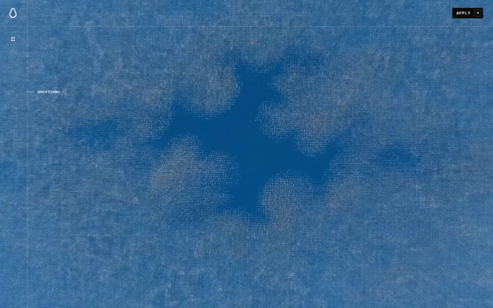

**Cambios vs anterior**
- figura mueve: div opacity 1→1 t=matrix(1.08434, 0, 0, 1.08434, 0, -2774.
- figura mueve: div opacity 1→1 t=matrix(1.05, 0, 0, 1.05, 0, -54)
- figura mueve: div opacity 1→1 t=matrix3d(0.810423, 0.215577, -0.469858, 
- figura mueve: div opacity 1→1 t=matrix(0.94987, 0, 0, 0.94987, 0, 0)
- figura mueve: div opacity 1→1 t=matrix(1, 0, 0, 1, 0, 0)
- figura mueve: div opacity 1→1 t=matrix(0.94987, 0, 0, 0.94987, 0, 0)
- figura mueve: div opacity 1→1 t=matrix(0.94987, 0, 0, 0.94987, 0, 0)
- figura mueve: div opacity 1→1 t=matrix(0.94987, 0, 0, 0.94987, 0, 0)
- figura mueve: div opacity 1→1 t=matrix3d(1, 0, 0, 0, 0, 1, 0, 0, 0, 0, 1
- figura mueve: div opacity 1→1 t=matrix(1, 0, 0, 1, 0, -477.3)
- figura mueve: div opacity 1→1 t=matrix3d(0.81, 0, 0, 0, 0, 0.81, 0, 0, 0

**Fondo:** `rgb(11, 10, 9)`

**Figuras / media**
- **div** (div) opacity=1 · `matrix(1.08434, 0, 0, 1.08434, 0, -2774.91)`
- **canvas** (canvas) opacity=1
- **div** (div) opacity=1 · `matrix(1.05, 0, 0, 1.05, 0, -54)`
- **canvas** (canvas) opacity=1
- **div** (div) opacity=1 · `matrix3d(0.810423, 0.215577, -0.469858, 0, -0.0794626, 0.900892, 0.30613`
- **div** (div) opacity=1 · `matrix(0.94987, 0, 0, 0.94987, 0, 0)`

**Texto visible**
- “Asked before” · 116.784px Flecha L
- “What does it cost to work with Pear?” · 26.222px Flecha M
- “What share of the revenue do you take?” · 26.222px Flecha M
- “Why revenue share instead of fees?” · 26.222px Flecha M
- “How do you measure the revenue you create?” · 26.222px Flecha M
- “How long before it pays off?” · 26.222px Flecha M

**Sticky:** div, div, video, canvas, nvm, Chapters

### Beat 22 — 80% (y=38520)

**Cambios vs anterior**
- figura mueve: div opacity 1→1 t=matrix(1.08434, 0, 0, 1.08434, 0, -2774.
- figura mueve: div opacity 1→1 t=matrix(1.05, 0, 0, 1.05, 0, -54)
- figura mueve: div opacity 1→1 t=matrix3d(0.929294, 0.0588364, -0.198196,
- figura mueve: div opacity 1→1 t=matrix(0.94987, 0, 0, 0.94987, 0, 0)
- figura mueve: div opacity 1→1 t=matrix(1, 0, 0, 1, 0, 0)
- figura mueve: div opacity 1→1 t=matrix(0.94987, 0, 0, 0.94987, 0, 0)
- figura mueve: div opacity 1→1 t=matrix(0.94987, 0, 0, 0.94987, 0, 0)
- figura mueve: div opacity 1→1 t=matrix(0.94987, 0, 0, 0.94987, 0, 0)
- figura mueve: div opacity 1→1 t=matrix3d(1, 0, 0, 0, 0, 1, 0, 0, 0, 0, 1
- figura mueve: div opacity 1→1 t=matrix(1, 0, 0, 1, 0, -477.3)
- figura mueve: div opacity 1→1 t=matrix3d(0.81, 0, 0, 0, 0, 0.81, 0, 0, 0

**Fondo:** `rgb(11, 10, 9)`

**Figuras / media**
- **div** (div) opacity=1 · `matrix(1.08434, 0, 0, 1.08434, 0, -2774.91)`
- **canvas** (canvas) opacity=1
- **div** (div) opacity=1 · `matrix(1.05, 0, 0, 1.05, 0, -54)`
- **canvas** (canvas) opacity=1
- **div** (div) opacity=1 · `matrix3d(0.929294, 0.0588364, -0.198196, 0, -0.0342381, 0.941105, 0.1316`
- **div** (div) opacity=1 · `matrix(0.94987, 0, 0, 0.94987, 0, 0)`

**Texto visible**
- “Asked before” · 116.784px Flecha L
- “What does it cost to work with Pear?” · 26.222px Flecha M
- “What share of the revenue do you take?” · 26.222px Flecha M
- “Why revenue share instead of fees?” · 26.222px Flecha M
- “How do you measure the revenue you create?” · 26.222px Flecha M
- “How long before it pays off?” · 26.222px Flecha M

**Sticky:** div, div, video, canvas, nvm, Chapters

### Beat 23 — 83% (y=39724)

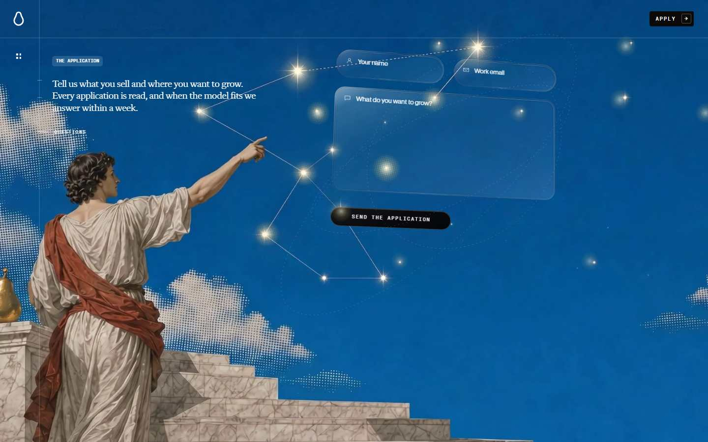

**Cambios vs anterior**
- figura mueve: div opacity 1→1 t=matrix(1.08434, 0, 0, 1.08434, 0, -2774.
- figura mueve: div opacity 1→1 t=matrix(1.05, 0, 0, 1.05, 0, -54)
- figura mueve: div opacity 1→1 t=matrix3d(0.937938, 0.0419085, -0.152598,
- figura mueve: div opacity 1→1 t=matrix(0.94987, 0, 0, 0.94987, 0, 0)
- figura mueve: div opacity 1→1 t=matrix(1, 0, 0, 1, 0, 0)
- figura mueve: div opacity 1→1 t=matrix(0.94987, 0, 0, 0.94987, 0, 0)
- figura mueve: div opacity 1→1 t=matrix(0.94987, 0, 0, 0.94987, 0, 0)
- figura mueve: div opacity 1→1 t=matrix(0.94987, 0, 0, 0.94987, 0, 0)
- figura mueve: div opacity 1→1 t=matrix3d(1, 0, 0, 0, 0, 1, 0, 0, 0, 0, 1
- figura mueve: div opacity 1→1 t=matrix(1, 0, 0, 1, 0, -477.3)
- figura mueve: div opacity 1→1 t=matrix3d(1, 0, 0, 0, 0, 1, 0, 0, 0, 0, 1
- figura mueve: div opacity 1→1 t=matrix3d(0.81, 0, 0, 0, 0, 0.81, 0, 0, 0

**Fondo:** `rgb(11, 10, 9)`

**Figuras / media**
- **div** (div) opacity=1 · `matrix(1.08434, 0, 0, 1.08434, 0, -2774.91)`
- **canvas** (canvas) opacity=1
- **div** (div) opacity=1 · `matrix(1.05, 0, 0, 1.05, 0, -54)`
- **canvas** (canvas) opacity=1
- **div** (div) opacity=1 · `matrix3d(0.937938, 0.0419085, -0.152598, 0, -0.026199, 0.943994, 0.10883`
- **div** (div) opacity=1 · `matrix(0.94987, 0, 0, 0.94987, 0, 0)`

**Texto visible**
- “Asked before” · 116.784px Flecha L
- “What does it cost to work with Pear?” · 26.222px Flecha M
- “What share of the revenue do you take?” · 26.222px Flecha M
- “Why revenue share instead of fees?” · 26.222px Flecha M
- “How do you measure the revenue you create?” · 26.222px Flecha M
- “How long before it pays off?” · 26.222px Flecha M

**Sticky:** div, div, video, canvas, nvm, Chapters

### Beat 24 — 90% (y=43335)

**Cambios vs anterior**
- figura mueve: div opacity 1→1 t=matrix(1.08434, 0, 0, 1.08434, 0, -2774.
- figura mueve: div opacity 1→1 t=matrix(1.05, 0, 0, 1.05, 0, -54)
- figura mueve: div opacity 1→1 t=matrix(0.75, 0, 0, 0.75, 0, 0)
- figura mueve: div opacity 1→1 t=matrix3d(0.985679, 0.0440416, -0.152598,
- figura mueve: div opacity 1→1 t=matrix(0.94987, 0, 0, 0.94987, 0, 0)
- figura mueve: div opacity 1→1 t=matrix(1, 0, 0, 1, 0, 0)
- figura mueve: div opacity 1→1 t=matrix(0.94987, 0, 0, 0.94987, 0, 0)
- figura mueve: div opacity 1→1 t=matrix(0.94987, 0, 0, 0.94987, 0, 0)
- figura mueve: div opacity 1→1 t=matrix(0.94987, 0, 0, 0.94987, 0, 0)
- figura mueve: div opacity 1→1 t=matrix3d(1, 0, 0, 0, 0, 1, 0, 0, 0, 0, 1
- figura mueve: div opacity 1→1 t=matrix(1, 0, 0, 1, 0, -477.3)
- texto aparece: “Search and links that put you in front of the crow”
- texto sale: “Not an agency on the clock, apartner in the upside”

**Fondo:** `rgb(11, 10, 9)`

**Figuras / media**
- **div** (div) opacity=1 · `matrix(1.08434, 0, 0, 1.08434, 0, -2774.91)`
- **canvas** (canvas) opacity=1
- **canvas** (canvas) opacity=1
- **div** (div) opacity=1 · `matrix(1.05, 0, 0, 1.05, 0, -54)`
- **canvas** (canvas) opacity=1
- **div** (div) opacity=1 · `matrix(0.75, 0, 0, 0.75, 0, 0)`

**Texto visible**
- “Asked before” · 116.784px Flecha L
- “What does it cost to work with Pear?” · 26.222px Flecha M
- “What share of the revenue do you take?” · 26.222px Flecha M
- “Why revenue share instead of fees?” · 26.222px Flecha M
- “How do you measure the revenue you create?” · 26.222px Flecha M
- “How long before it pays off?” · 26.222px Flecha M

**Sticky:** div, div, canvas, video, canvas, nvm, Chapters

### Beat 25 — 93% (y=44539)

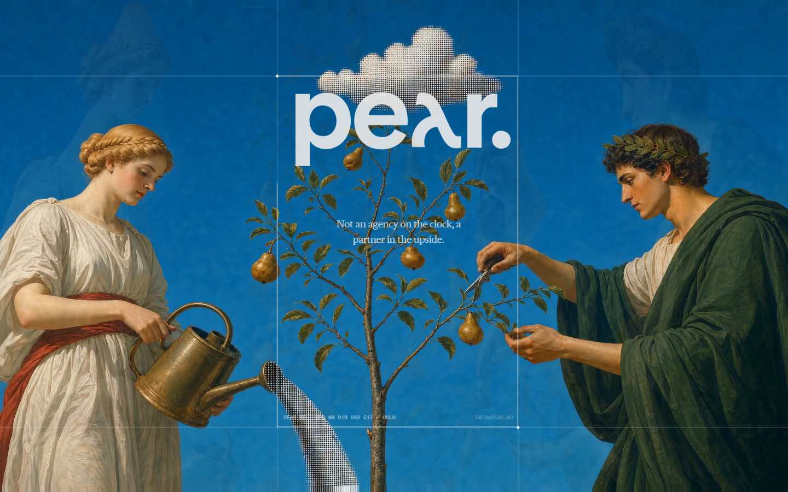

**Cambios vs anterior**
- figura mueve: div opacity 1→1 t=matrix(1.08434, 0, 0, 1.08434, 0, -2774.
- figura mueve: div opacity 1→1 t=matrix(1.05, 0, 0, 1.05, 0, -54)
- figura mueve: div opacity 1→1 t=matrix(0.75, 0, 0, 0.75, 0, 0)
- figura mueve: div opacity 1→1 t=matrix(0.94987, 0, 0, 0.94987, 0, 0)
- figura mueve: div opacity 1→1 t=matrix(1, 0, 0, 1, 0, 0)
- figura mueve: div opacity 1→1 t=matrix(0.94987, 0, 0, 0.94987, 0, 0)
- figura mueve: div opacity 1→1 t=matrix(0.94987, 0, 0, 0.94987, 0, 0)
- figura mueve: div opacity 1→1 t=matrix(0.94987, 0, 0, 0.94987, 0, 0)
- figura mueve: div opacity 1→1 t=matrix3d(1, 0, 0, 0, 0, 1, 0, 0, 0, 0, 1
- figura mueve: div opacity 1→1 t=matrix3d(0.81, 0, 0, 0, 0, 0.81, 0, 0, 0

**Fondo:** `rgb(11, 10, 9)`

**Figuras / media**
- **div** (div) opacity=1 · `matrix(1.08434, 0, 0, 1.08434, 0, -2774.91)`
- **canvas** (canvas) opacity=1
- **canvas** (canvas) opacity=1
- **div** (div) opacity=1 · `matrix(1.05, 0, 0, 1.05, 0, -54)`
- **canvas** (canvas) opacity=1
- **div** (div) opacity=1 · `matrix(0.75, 0, 0, 0.75, 0, 0)`

**Texto visible**
- “Asked before” · 116.784px Flecha L
- “What does it cost to work with Pear?” · 26.222px Flecha M
- “What share of the revenue do you take?” · 26.222px Flecha M
- “Why revenue share instead of fees?” · 26.222px Flecha M
- “How do you measure the revenue you create?” · 26.222px Flecha M
- “How long before it pays off?” · 26.222px Flecha M

**Sticky:** div, div, canvas, video, canvas, nvm, Chapters

### Beat 26 — 95% (y=45743)

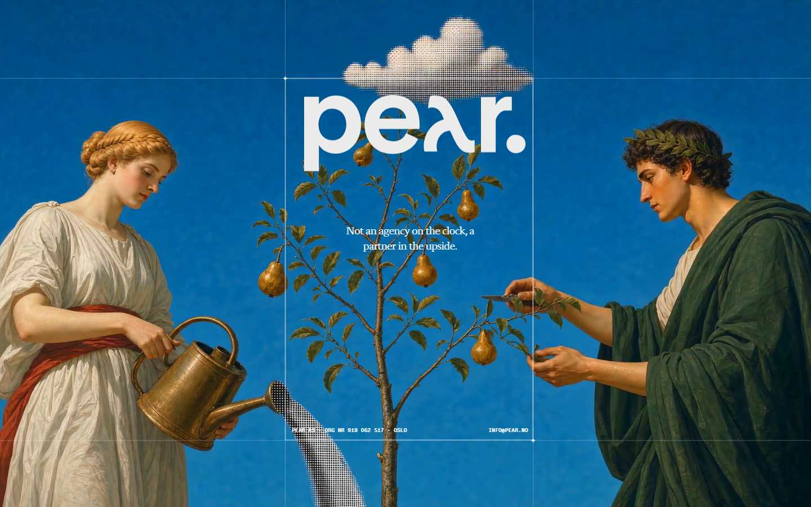

**Cambios vs anterior**
- figura mueve: div opacity 1→1 t=matrix(1.08434, 0, 0, 1.08434, 0, -2774.
- figura mueve: div opacity 1→1 t=matrix(1.05, 0, 0, 1.05, 0, -54)
- figura mueve: div opacity 1→1 t=matrix(0.75, 0, 0, 0.75, 0, 0)
- figura mueve: div opacity 1→1 t=matrix(0.94987, 0, 0, 0.94987, 0, 0)
- figura mueve: div opacity 1→1 t=matrix(1, 0, 0, 1, 0, 0)
- figura mueve: div opacity 1→1 t=matrix(0.94987, 0, 0, 0.94987, 0, 0)
- figura mueve: div opacity 1→1 t=matrix(0.94987, 0, 0, 0.94987, 0, 0)
- figura mueve: div opacity 1→1 t=matrix(0.94987, 0, 0, 0.94987, 0, 0)
- figura mueve: div opacity 1→1 t=matrix3d(1, 0, 0, 0, 0, 1, 0, 0, 0, 0, 1
- figura mueve: div opacity 1→1 t=matrix(1, 0, 0, 1, 0, -477.3)
- texto aparece: “Not an agency on the clock, apartner in the upside”
- texto sale: “Search and links that put you in front of the crow”

**Fondo:** `rgb(11, 10, 9)`

**Figuras / media**
- **div** (div) opacity=1 · `matrix(1.08434, 0, 0, 1.08434, 0, -2774.91)`
- **canvas** (canvas) opacity=1
- **div** (div) opacity=1 · `matrix(1.05, 0, 0, 1.05, 0, -54)`
- **canvas** (canvas) opacity=1
- **canvas** (canvas) opacity=1
- **div** (div) opacity=1 · `matrix(0.75, 0, 0, 0.75, 0, 0)`

**Texto visible**
- “Asked before” · 116.784px Flecha L
- “What does it cost to work with Pear?” · 26.222px Flecha M
- “What share of the revenue do you take?” · 26.222px Flecha M
- “Why revenue share instead of fees?” · 26.222px Flecha M
- “How do you measure the revenue you create?” · 26.222px Flecha M
- “How long before it pays off?” · 26.222px Flecha M

**Sticky:** div, div, canvas, video, canvas, nvm, Chapters

### Beat 27 — 100% (y=47250)

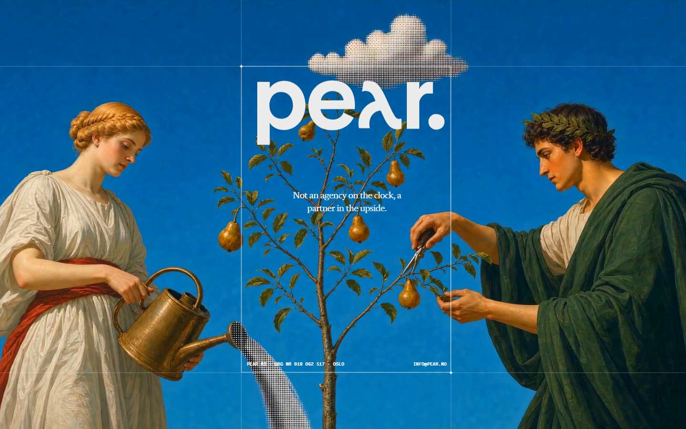

**Cambios vs anterior**
- figura mueve: div opacity 1→1 t=matrix(1.08434, 0, 0, 1.08434, 0, -2774.
- figura mueve: div opacity 1→1 t=matrix(1.05, 0, 0, 1.05, 0, -54)
- figura mueve: div opacity 1→1 t=matrix(0.75, 0, 0, 0.75, 0, 0)
- figura mueve: div opacity 1→1 t=matrix(0.94987, 0, 0, 0.94987, 0, 0)
- figura mueve: div opacity 1→1 t=matrix(1, 0, 0, 1, 0, 0)
- figura mueve: div opacity 1→1 t=matrix(0.94987, 0, 0, 0.94987, 0, 0)
- figura mueve: div opacity 1→1 t=matrix(0.94987, 0, 0, 0.94987, 0, 0)
- figura mueve: div opacity 1→1 t=matrix(0.94987, 0, 0, 0.94987, 0, 0)
- figura mueve: div opacity 1→1 t=matrix3d(1, 0, 0, 0, 0, 1, 0, 0, 0, 0, 1
- figura mueve: div opacity 1→1 t=matrix(1, 0, 0, 1, 0, -477.3)

**Fondo:** `rgb(11, 10, 9)`

**Figuras / media**
- **div** (div) opacity=1 · `matrix(1.08434, 0, 0, 1.08434, 0, -2774.91)`
- **canvas** (canvas) opacity=1
- **div** (div) opacity=1 · `matrix(1.05, 0, 0, 1.05, 0, -54)`
- **canvas** (canvas) opacity=1
- **canvas** (canvas) opacity=1
- **div** (div) opacity=1 · `matrix(0.75, 0, 0, 0.75, 0, 0)`

**Texto visible**
- “Asked before” · 116.784px Flecha L
- “What does it cost to work with Pear?” · 26.222px Flecha M
- “What share of the revenue do you take?” · 26.222px Flecha M
- “Why revenue share instead of fees?” · 26.222px Flecha M
- “How do you measure the revenue you create?” · 26.222px Flecha M
- “How long before it pays off?” · 26.222px Flecha M

**Sticky:** div, div, canvas, video, canvas, nvm, Chapters

## Anotación IA

_Sin `GEMINI_API_KEY` / `GOOGLE_API_KEY` — solo captura mecánica._

## Port a SCROLLLAB

1. Smooth scroll → `SmoothScrollProvider` (Lenis)
2. Cada beat → primitivo del cookbook (`docs/motion-cookbook.md`) + sección en `src/components/sections/pear/`
3. Copy genérico (Headline N / Link N / lorem)
4. Actualizar [[Template reference index]] + mapa del SKU

## Gaps (llenar a mano tras mirar)

- [ ] Hero
- [ ] Sección firma (la más difícil)
- [ ] Footer
